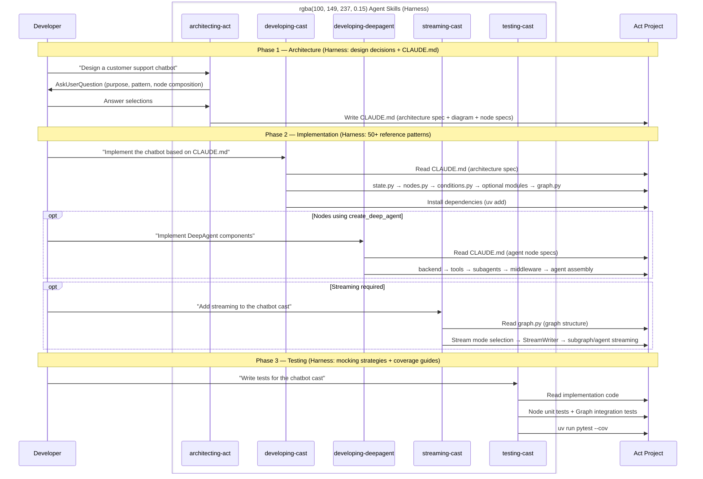
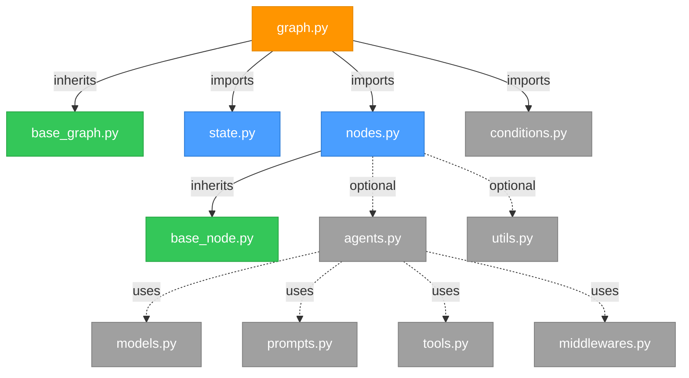
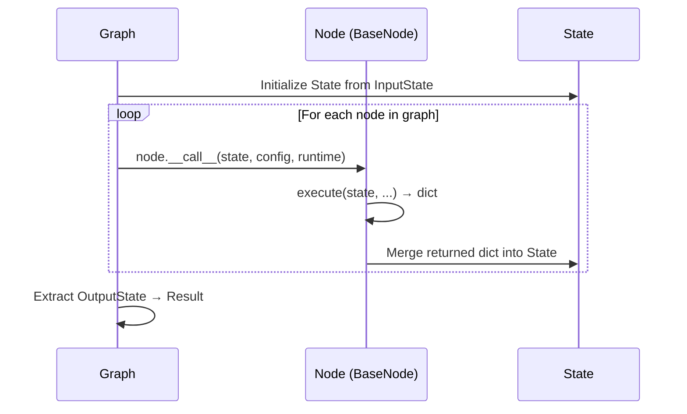

<div align="center">
  <a href="https://www.proact0.org/">
    <picture>
      <source media="(prefers-color-scheme: light)" srcset=".github/images/light-theme.png">
      <source media="(prefers-color-scheme: dark)" srcset=".github/images/dark-theme.png">
      
    </picture>
  </a>
</div>

<div align="center">
  <h2>Act Operator</h2>
</div>

<div align="center">
  <a href="https://www.apache.org/licenses/LICENSE-2.0" target="_blank"></a>
  <a href="https://pypistats.org/packages/act-operator" target="_blank"></a>
  <a href="https://pypi.org/project/act-operator/#history" target="_blank"></a>
  <a href="https://www.linkedin.com/company/proact0" target="_blank">
    
  </a>
  <a href="https://www.proact0.org/" target="_blank">
    
  </a>
</div>

<br>

※ 한국어로 읽으시는 경우: [README_KR.md](README_KR.md)

**A harness for AI-assisted LangGraph development.** Raises the floor so every developer gets consistent, high-quality agent output — regardless of experience level.

```bash
uvx --from act-operator act new
```

<picture>
  <source media="(prefers-color-scheme: light)" srcset=".github/images/flowchart-light-theme.png">
  <source media="(prefers-color-scheme: dark)" srcset=".github/images/flowchart-dark-theme.png">
  
</picture>

## The Problem: Context Disparity

When you ask an AI agent to implement a LangGraph workflow, the quality of the output depends almost entirely on the context it receives. A developer who deeply knows the codebase structure, the team's conventions, and the LangGraph 1.0+ API gets excellent results. Someone touching LangGraph for the first time — or working in an unfamiliar part of the codebase — gets something generic, inconsistent, or subtly wrong.

This is the **context disparity problem**: the gap between what the most-informed developer extracts from AI tools and what everyone else gets.

A harness eliminates this gap. By standardizing the environment in which the agent operates — the project structure, the decision trees, the reference patterns, the persistent specs — you raise the floor for the entire team.

**Act Operator is a harness for LangGraph development.**

## What is a Harness?

A harness is the system of scaffolding, executable knowledge, and feedback loops that wraps your AI agents so they reliably produce correct output — regardless of who is driving.

Act Operator implements this with three layers:

| Layer | Role | How Act implements it |
|-------|------|----------------------|
| **Scaffolding** | Structure assembled before the first agent prompt | `act new` — generates the full project skeleton with module conventions and base classes baked in |
| **Executable SSOT** | Knowledge encoded as living files agents read at runtime | Agent Skills — 50+ reference patterns, decision trees, and architecture templates in `.claude/skills/` |
| **Feedback Loop** | Specs that survive across sessions and keep agents aligned | `CLAUDE.md` — architecture diagrams, node specifications, and development commands generated by skills and maintained across sessions |

These three layers work together. Scaffolding gives agents a consistent starting point. Skills give them the knowledge to reason correctly within that structure. CLAUDE.md gives them persistent memory of what was designed — so the agent in your next session picks up exactly where the last one left off.

> **Terminology**: An **Act** is a harness instance — your LangGraph project. A **Cast** is a graph unit within it (one StateGraph = one Cast). A single Act can contain multiple Casts as independent packages in a monorepo.

**Use Cases**: Conversational agents, agentic AI systems, business workflow automation, multi-step data pipelines, document processing flows — or any application requiring stateful graph/workflow orchestration.

## Quick Start

Requires Python 3.11+.

```bash
# Create a new Act project
uvx --from act-operator act new

# Follow interactive prompts:
# - Path: default [.] or new path
# - Act name: project_name
# - Cast name: workflow_name
```

After creation, install dependencies:

```bash
uv sync
```

### Start Building with AI

Launch your AI tool in the project root. If you use **Claude Code**:

```bash
claude
```

The skills in `.claude/skills/` are pre-loaded. Mention a skill by name to activate it:

```
Use @architecting-act to design a customer support chatbot
```

> **Note for other tools**: The `.claude` directory naming is specific to Claude Code. If you use Cursor, Gemini CLI, or other AI tools that support skill directories, rename it according to that tool's conventions.

### OpenCode Quick Start

```bash
opencode .
# or
opencode run "Design a customer support chatbot"
```

OpenCode reads environment variables from `.env` at the project root (configured in `langgraph.json` as `env: ".env"`).

## Skills: The Executable SSOT

Traditional teams share LangGraph knowledge through wikis, architecture docs, and tribal memory. The problem: documentation decays, wikis go stale, and tribal memory doesn't survive team changes.

Skills encode that knowledge as **living files that agents read directly**. Instead of you telling the agent what patterns exist, the skill shows the agent the exact patterns, decision trees, and reference implementations it needs — at the moment it needs them. All patterns reference official LangChain 1.0+/LangGraph 1.0+ documentation, not guesswork. The skills are lean by design: context-aware guidance without unnecessary code generation, keeping token usage low across long sessions.

```
.claude/skills/
├── architecting-act/      # Design phase — agentic patterns, CLAUDE.md generation
├── developing-cast/       # Implementation phase — 50+ LangGraph patterns
├── developing-deepagent/  # DeepAgent phase — subagents, backends, sandbox, HITL
├── streaming-cast/        # Streaming phase — stream modes, SSE/WebSocket integration
└── testing-cast/          # Testing phase — mocking strategies, fixtures, coverage
```

Each skill contains a `SKILL.md` (entry point) and `resources/` (reference docs). `architecting-act` additionally includes `scripts/` (validation) and `templates/` (CLAUDE.md generation).

**Available Skills**:

- `architecting-act` — Design graph architectures and node composition strategies. Uses an interactive question sequence to understand requirements before producing a CLAUDE.md that becomes the persistent spec for the implementation phase. Supports 4 modes: initial design, add cast, extract sub-cast, redesign cast.
- `developing-cast` — Implement LangGraph casts (state, nodes, agents with `create_agent`, tools, memory, middlewares, graph assembly). Reads CLAUDE.md as its source of truth.
- `developing-deepagent` — Implement DeepAgent harnesses (`create_deep_agent`, subagents, backends, sandbox execution, HITL). Used when a cast node requires multi-step planning or subagent delegation.
- `streaming-cast` — Implement LangGraph v2 streaming for graphs with subgraphs and agents. Covers stream modes (values, messages, updates, custom, events), StreamWriter, subgraph/agent streaming with namespace parsing, and transport integration (SSE, WebSocket).
- `testing-cast` — Write pytest tests with LLM mocking strategies. Covers node-level unit tests and graph integration tests.

### Node Composition Types

The `architecting-act` skill designs graph architecture around 5 node types:

| Node Type | Use when |
|-----------|----------|
| **`START` / `END`** | Built-in virtual nodes — flow control markers for graph entry and termination |
| **`ToolNode`** | Stateless tool execution — parses `AIMessage.tool_calls`, no reasoning loop |
| **`create_agent`** | Subgraph node/node-internal subgraph needing tools + autonomous reasoning (ReAct) loop |
| **`create_deep_agent`** | Subgraph node/node-internal subgraph needing subagent delegation, backends, or sandbox |
| **Custom Node** | `BaseNode`/`AsyncBaseNode` — single deterministic operation, user-defined logic |

### Reference Pattern Categories

The `developing-cast` skill includes patterns for every major LangGraph concern:

| Category | Patterns |
|----------|----------|
| **Core** | State, sync/async nodes, conditional edges, subgraph composition |
| **Agents** | `create_agent` with tools, structured output, multi-agent networks |
| **Memory** | Short-term (conversation history, trimming, summarization), long-term (Store API) |
| **Middleware** | Retry, fallback models, guardrails, call limits, human-in-the-loop, context editing |
| **Observability** | LangSmith integration, structured logging |
| **Integrations** | Embeddings, vector stores (FAISS/Pinecone/Chroma), text splitters |

## The CLAUDE.md Feedback Loop

The key to keeping agents aligned across sessions is the `CLAUDE.md` spec. `architecting-act` generates it; `developing-cast` reads it.

```
Root /CLAUDE.md          ← Act overview, purpose, table of all Casts
Cast /casts/{cast}/CLAUDE.md  ← Architecture diagram, node specifications for this Cast
```

The CLAUDE.md is not static documentation — it is a **living specification** that:
- Gets generated by the architecture skill with diagrams and node specs
- Gets read by the implementation skill as the source of truth
- Gets updated by the architecture skill when you add casts, extract sub-casts, or redesign
- Gets synced to match existing code when you use Mode 4 (Redesign Cast)

This loop is the harness feedback mechanism: every agent session anchors to the same spec, producing consistent output regardless of who prompts it.

## Skill-Driven Development Flow



## Workflow Examples

**Example 1: Starting a New Project**
```plaintext
1. Create Project   → uvx --from act-operator act new

2. Design           → "Design a customer support chatbot"
   (architecting-act Mode 1: asks about purpose, pattern, node composition
    → generates /CLAUDE.md + /casts/chatbot/CLAUDE.md with diagram and node specs)

3. Implement        → "Implement the chatbot based on CLAUDE.md"
   (developing-cast: reads CLAUDE.md → implements state/nodes/agents/graph)

4. Add Streaming    → "Add streaming to the chatbot cast"
   (streaming-cast: stream mode selection → token streaming, subgraph streaming)

5. Test             → "Write comprehensive tests for the chatbot"
   (testing-cast: LLM mocking + node unit tests + graph integration tests)
```

**Example 2: Adding a Cast to an Existing Project**
```plaintext
1. Design New Cast  → "Add a knowledge-base cast for document indexing"
   (architecting-act Mode 2: reads /CLAUDE.md for context → designs new cast
    → updates root CLAUDE.md + creates /casts/knowledge-base/CLAUDE.md)

2. Scaffold Cast    → uv run act cast -c "knowledge-base"
   (per CLAUDE.md development commands)

3. Implement        → "Implement knowledge-base based on its CLAUDE.md"
   (developing-cast: reads cast CLAUDE.md → implements components)
```

**Example 3: Redesigning an Existing Cast**
```plaintext
1. Analyze          → "The chatbot cast has grown complex, help me redesign it"
   (architecting-act Mode 4: reads graph.py, nodes.py, agents.py, conditions.py
    → presents current architecture summary)

2. Redesign         → Select scope: "Change node composition, restructure routing"
   (architecting-act: proposes changes, waits for confirmation)

3. Sync CLAUDE.md   → Updates CLAUDE.md to reflect the redesigned architecture
   (developing-cast can now re-implement against the new spec)
```

**Example 4: Extracting a Sub-Cast**
```plaintext
1. Analyze Complexity → "The chatbot cast has 12 nodes and feels tangled"
   (architecting-act Mode 3: identifies reusable validation logic)

2. Extract          → "Extract input validation into a separate sub-cast"
   (architecting-act: creates /casts/input-validator/CLAUDE.md
    → updates parent cast CLAUDE.md with sub-cast references)

3. Implement Sub-Cast → "Implement input-validator"
   (developing-cast: implements sub-cast, manages dependencies via CLAUDE.md commands)
```

## Project Structure

```
my_workflow/
├── .claude/
│   └── skills/                    # Harness: skills loaded by AI agents
│       ├── architecting-act/      # Design phase: patterns, templates, validation
│       ├── developing-cast/       # Implementation phase: 50+ reference patterns
│       ├── developing-deepagent/  # DeepAgent phase: backends, subagents, sandbox
│       ├── streaming-cast/        # Streaming phase: stream modes, subgraph streaming
│       └── testing-cast/          # Testing phase: mocking, fixtures, coverage
├── casts/
│   ├── base_node.py              # Base node class (sync/async, signature validation)
│   ├── base_graph.py             # Base graph class (abstract build method)
│   └── chatbot/                  # A Cast (graph package)
│       ├── CLAUDE.md             # Living spec: architecture diagram + node specs
│       ├── modules/
│       │   ├── state.py          # [Required] InputState, OutputState, State
│       │   ├── nodes.py          # [Required] Node implementations
│       │   ├── agents.py         # [Optional] Agent configurations (create_agent)
│       │   ├── tools.py          # [Optional] Tool definitions / MCP adapters
│       │   ├── models.py         # [Optional] LLM model configs / structured output
│       │   ├── conditions.py     # [Optional] Routing conditions
│       │   ├── middlewares.py    # [Optional] Lifecycle hooks
│       │   ├── prompts.py        # [Optional] Prompt templates
│       │   └── utils.py          # [Optional] Helper functions
│       ├── graph.py              # Graph assembly → entry point
│       └── pyproject.toml        # Cast-specific dependencies
├── tests/
│   ├── cast_tests/               # Graph integration tests
│   └── node_tests/               # Node unit tests
├── CLAUDE.md                     # Root spec: Act overview + Cast index
├── langgraph.json                # LangGraph entry points
├── pyproject.toml                # Monorepo workspace (uv workspace, shared deps)
└── TEMPLATE_README.md            # Template usage guide
```

### Module Dependency



> **Legend**: 🟠 Entry Point / 🔵 Required / 🟢 Base Class / ⚫ Optional

### Execution Flow

The runtime contract the harness is built around: each node reads state, returns a partial update, and the graph merges it.



## CLI Commands

```bash
# Create new Act project
act new [OPTIONS]
  --act-name TEXT       Project name
  --cast-name TEXT      Initial cast name
  --path PATH           Target directory

# Add cast to existing project
act cast [OPTIONS]
  --cast-name TEXT      Cast name
  --path PATH           Act project directory
```

After scaffolding, see `TEMPLATE_README.md` in your generated project for detailed usage — dependency management, development server, graph registry configuration, and more.

## Contributing

We welcome contributions from the community! Please read our contributing guide:

- [CONTRIBUTING.md](CONTRIBUTING.md) (English)

### Contributors

Thank you to all our contributors! Your contributions make Act Operator better.

<a href="https://github.com/Proact0/act-operator/graphs/contributors">
  
</a>

## License

Apache License 2.0 - see [LICENSE](https://www.apache.org/licenses/LICENSE-2.0) for details.

---

<div align="center">
  <p>Built with ❤️ by <a href="https://www.proact0.org/">Proact0</a></p>
  <p>A non-profit open-source hub dedicated to standardizing Act (AX Template) and boosting AI productivity</p>
</div>
