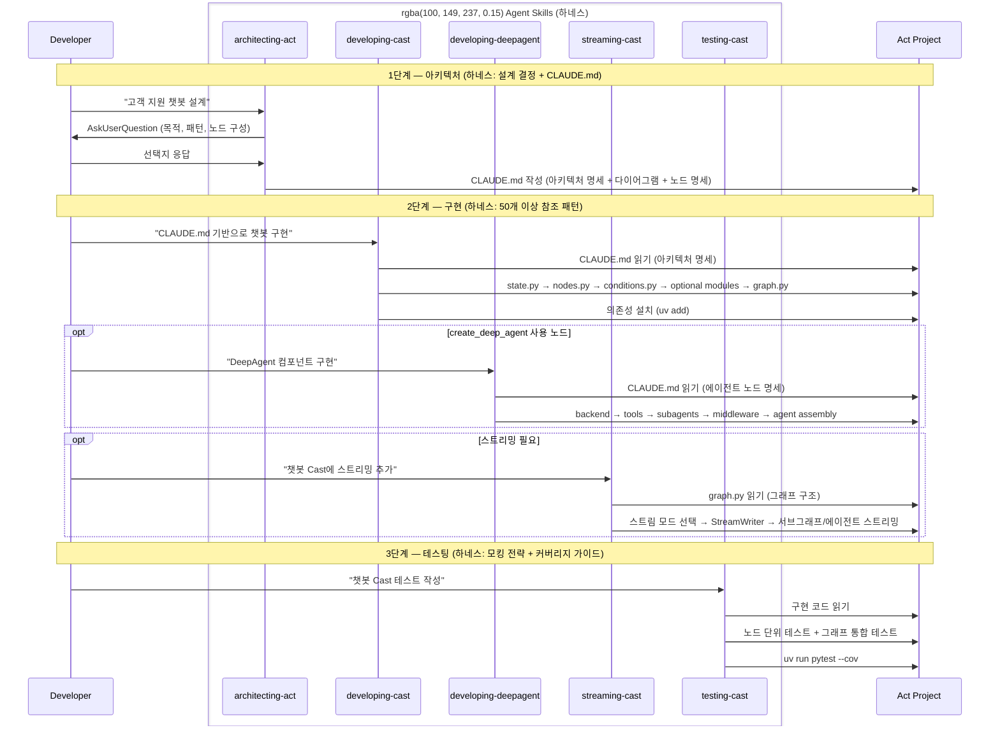
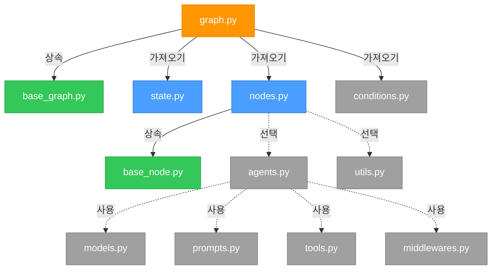
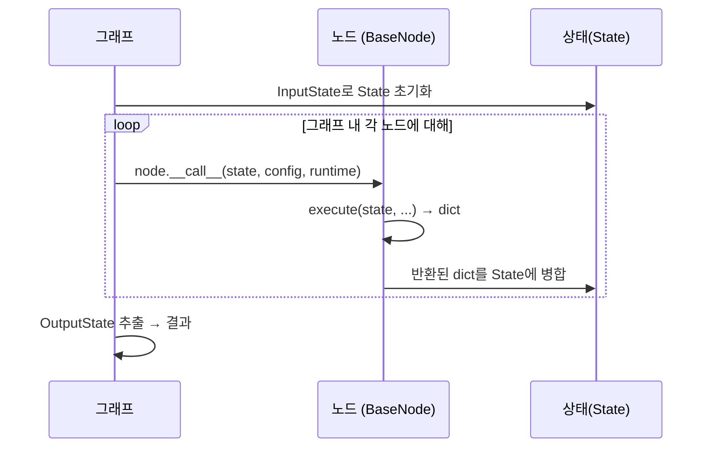

<div align="center">
  <a href="https://www.proact0.org/">
    <picture>
      <source media="(prefers-color-scheme: light)" srcset=".github/images/light-theme.png">
      <source media="(prefers-color-scheme: dark)" srcset=".github/images/dark-theme.png">
      
    </picture>
  </a>
</div>

<div align="center">
  <h2>Act Operator</h2>
</div>

<div align="center">
  <a href="https://www.apache.org/licenses/LICENSE-2.0" target="_blank"></a>
  <a href="https://pypistats.org/packages/act-operator" target="_blank"></a>
  <a href="https://pypi.org/project/act-operator/#history" target="_blank"></a>
  <a href="https://www.linkedin.com/company/proact0" target="_blank">
    
  </a>
  <a href="https://www.proact0.org/" target="_blank">
    
  </a>
</div>

<br>

※ Read this in English: [README.md](README.md)

**AI 기반 LangGraph 개발을 위한 하네스.** 경험 수준과 무관하게 모든 개발자가 일관되고 높은 품질의 에이전트 출력을 얻을 수 있도록 팀의 최소 수준을 높입니다.

```bash
uvx --from act-operator act new
```

<picture>
  <source media="(prefers-color-scheme: light)" srcset=".github/images/flowchart-light-theme-kr.png">
  <source media="(prefers-color-scheme: dark)" srcset=".github/images/flowchart-dark-theme-kr.png">
  
</picture>

## 문제: 컨텍스트 격차

AI 에이전트에게 LangGraph 워크플로우를 구현해달라고 요청할 때, 출력 품질은 거의 전적으로 에이전트가 받는 컨텍스트에 달려 있습니다. 코드베이스 구조, 팀 컨벤션, LangGraph 1.0+ API를 깊이 이해하는 개발자는 뛰어난 결과를 얻습니다. LangGraph를 처음 접하거나 낯선 코드베이스 영역을 다루는 개발자는 일반적이고 일관성 없거나 미묘하게 잘못된 결과를 받습니다.

이것이 **컨텍스트 격차 문제**입니다: 가장 경험 많은 개발자가 AI 도구에서 얻는 것과 다른 모든 사람이 얻는 것 사이의 차이.

하네스(Harness)가 이 격차를 없앱니다. 에이전트가 작동하는 환경 — 프로젝트 구조, 결정 트리, 참조 패턴, 지속적인 명세 — 을 표준화함으로써 팀 전체의 최소 수준을 높입니다.

**Act Operator는 모든 LangGraph 프로젝트들을 위한 하네스입니다.**

## 하네스란 무엇인가?

하네스는 누가 프롬프트를 입력하든 상관없이 AI 에이전트가 올바른 출력을 안정적으로 생성할 수 있도록 감싸는 구조, 제약, 피드백 루프의 시스템입니다.

Act Operator는 이를 세 가지 레이어로 구현합니다:

| 레이어 | 역할 | Act에서의 구현 |
|--------|------|---------------|
| **스캐폴딩** | 첫 번째 에이전트 프롬프트 이전에 조립되는 구조 | `act new` — 모듈 컨벤션과 베이스 클래스가 내장된 완전한 프로젝트 스켈레톤 생성 |
| **실행 가능한 SSOT** | 에이전트와 사람이 런타임에 읽는 살아있는 파일로 인코딩된 지식 | Act Template (프로젝트 구조, CI, 베이스 클래스, 설정), Agent Skills (에이전트용 50개 이상 패턴), Drawkit (팀용 시각적 아키텍처) |
| **피드백 루프** | 세션을 넘어 에이전트를 정렬 상태로 유지하는 명세 | `CLAUDE.md` — 스킬이 생성하고 세션 간 유지되는 아키텍처 다이어그램, 노드 명세, 개발 명령어 |

이 세 레이어는 함께 작동합니다. 스캐폴딩은 에이전트에게 일관된 시작점을 제공합니다. SSOT 레이어는 세 가지 형태의 실행 가능한 지식을 제공합니다: **Act Template**은 프로젝트 컨벤션(CI 워크플로우, 베이스 클래스, 테스트 구조, 설정)을 확립하고, **스킬**은 그 구조 안에서 에이전트가 올바르게 추론할 수 있는 패턴을, **Drawkit**은 팀에게 아키텍처 다이어그램을 위한 공유 시각 어휘를 제공합니다. CLAUDE.md는 설계된 내용에 대한 지속적인 메모리를 제공합니다 — 다음 세션의 에이전트가 이전 세션이 중단된 지점에서 정확히 이어받을 수 있습니다.

> **용어 정리**: **Act**는 하네스 인스턴스 — LangGraph 프로젝트입니다. **Cast**는 그 안의 그래프 단위입니다 (하나의 StateGraph = 하나의 Cast). 하나의 Act는 모노레포 안에 독립적인 패키지로 여러 Cast를 포함할 수 있습니다.

**사용 사례**: 대화형 에이전트, 에이전트 AI 시스템, 비즈니스 워크플로우 자동화, 다단계 데이터 파이프라인, 문서 처리 플로우 — 또는 상태 기반 그래프/워크플로우 오케스트레이션이 필요한 모든 애플리케이션.

## 빠른 시작

Python 3.11+ 필요.

```bash
# 새로운 Act 프로젝트 생성
uvx --from act-operator act new

# 대화형 프롬프트 따라하기:
# - 경로: 기본값 [.] 또는 새 경로
# - Act 이름: project_name
# - Cast 이름: workflow_name
```

생성 후 의존성 설치:

```bash
uv sync
```

### AI와 함께 빌드 시작하기

프로젝트 루트에서 AI 도구를 실행합니다. **Claude Code**를 사용하는 경우:

```bash
claude
```

`.claude/skills/`의 스킬이 사전 로드되어 있습니다. 스킬 이름을 언급하여 활성화합니다:

```
@architecting-act를 사용해서 고객 지원 챗봇을 설계해줘
```

> **다른 도구 사용 시 참고**: `.claude` 디렉터리 명명은 Claude Code 전용입니다. Cursor, Gemini CLI 등 스킬 디렉터리를 지원하는 다른 AI 도구를 사용하는 경우, 해당 도구의 컨벤션에 맞게 이름을 변경하세요.

### OpenCode 빠른 시작

```bash
opencode .
# 또는
opencode run "고객 지원 챗봇을 설계해줘"
```

OpenCode는 프로젝트 루트의 `.env`를 사용합니다(`langgraph.json`의 `env: ".env"` 설정).

## 실행 가능한 SSOT

전통적인 팀은 LangGraph 지식을 위키, 아키텍처 문서, 구전 지식으로 공유합니다. 문제는 문서가 낡아가고, 위키가 오래되고, 구전 지식이 팀원 변화에서 살아남지 못한다는 점입니다.

하네스는 이 지식을 **살아있는 파일**로 인코딩합니다 — 정적 문서가 아닌, 에이전트와 사람이 직접 읽는 실행 가능한 참조입니다. Act Operator는 세 가지 상호보완적 SSOT 구성요소를 스캐폴딩합니다:

| 구성요소 | 대상 | 제공하는 것 |
|----------|------|------------|
| **Act Template** (scaffold) | 개발자 | 프로젝트 스켈레톤 자체 — CI 워크플로우, 베이스 클래스, 테스트 구조, pre-commit 훅, 모노레포 설정, `.env.example`, `TEMPLATE_README.md` 사용 가이드 |
| **Agent Skills** (`.claude/skills/`) | AI 에이전트 | 50개 이상 참조 패턴, 결정 트리, 아키텍처 템플릿 — 에이전트가 런타임에 읽음 |
| **Drawkit** (`drawkit.xml`) | 팀 | draw.io용 Act 아키텍처 사전 정의 쉐이프 — 사람 간 커뮤니케이션을 위한 공유 시각 어휘 |

각 구성요소는 서로 다른 대상을 겨냥하면서 동일한 기저 컨벤션을 참조합니다. Act Template은 에이전트와 개발자 모두가 작업하는 구조적 기반을 확립합니다. 스킬은 그 구조 안에서 에이전트가 올바르게 구축하는 방법을, Drawkit은 팀에게 아키텍처 시각화 방법을 알려줍니다.

### Agent Skills

스킬은 LangGraph 지식을 에이전트가 직접 읽는 파일로 인코딩합니다. 에이전트에게 어떤 패턴이 존재하는지 당신이 설명할 필요 없이, 스킬이 에이전트에게 필요한 정확한 패턴, 결정 트리, 참조 구현을 직접 보여줍니다. 모든 패턴은 추측이 아닌 공식 LangChain 1.0+/LangGraph 1.0+ 문서를 참조합니다. 스킬은 설계상 간결합니다: 불필요한 코드 생성 없이 컨텍스트 인식 가이드를 제공하여 긴 세션에서도 토큰 사용을 최소화합니다.

```
.claude/skills/
├── architecting-act/      # 설계 단계 — 에이전트 패턴, CLAUDE.md 생성
├── developing-cast/       # 구현 단계 — 50개 이상 LangGraph 패턴
├── developing-deepagent/  # DeepAgent 단계 — 서브에이전트, 백엔드, 샌드박스, HITL
├── streaming-cast/        # 스트리밍 단계 — 스트림 모드, SSE/WebSocket 통합
└── testing-cast/          # 테스팅 단계 — 모킹 전략, 픽스처, 커버리지
```

각 스킬은 `SKILL.md`(진입점)와 `resources/`(참조 문서)를 포함합니다. `architecting-act`는 추가로 `scripts/`(검증)와 `templates/`(CLAUDE.md 생성)를 포함합니다.

**사용 가능한 스킬**:

- `architecting-act` — 그래프 아키텍처 및 노드 구성 전략 설계. 요구사항을 파악하기 위한 대화형 질문 시퀀스를 사용하고, 구현 단계의 지속적인 명세가 되는 CLAUDE.md를 출력합니다. 4가지 모드: 초기 설계, Cast 추가, Sub-Cast 추출, Cast 재설계.
- `developing-cast` — LangGraph Cast 구현 (state, nodes, `create_agent` 에이전트, tools, memory, middlewares, graph 조립). CLAUDE.md를 단일 진실 소스(Source of Truth)로 읽습니다.
- `developing-deepagent` — DeepAgent 하네스 구현 (`create_deep_agent`, 서브에이전트, 백엔드, 샌드박스 실행, HITL). Cast 노드에 다단계 계획이나 서브에이전트 위임이 필요한 경우 사용합니다.
- `streaming-cast` — 서브그래프와 에이전트가 포함된 그래프를 위한 LangGraph v2 스트리밍 구현. 스트림 모드 (values, messages, updates, custom, events), StreamWriter, 네임스페이스 파싱을 통한 서브그래프/에이전트 스트리밍, 전송 계층 통합 (SSE, WebSocket)을 커버합니다.
- `testing-cast` — LLM 모킹 전략을 사용한 pytest 테스트 작성. 노드 레벨 단위 테스트와 그래프 통합 테스트를 커버합니다.

### 노드 구성 유형

`architecting-act` 스킬이 그래프 아키텍처 설계 시 다루는 5가지 노드 유형:

| 노드 유형 | 사용 시점 |
|-----------|----------|
| **`START` / `END`** | 빌트인 가상 노드 — 그래프 진입과 종료를 위한 흐름 제어 마커 |
| **`ToolNode`** | 상태 없는 도구 실행 — `AIMessage.tool_calls` 파싱, 추론 루프 없음 |
| **`create_agent`** | 도구 + 자율 추론 루프가 필요한 서브그래프 노드/노드 내 서브그래프 |
| **`create_deep_agent`** | 서브에이전트 위임, 백엔드, 또는 샌드박스가 필요한 서브그래프 노드/노드 내 서브그래프 |
| **Custom Node** | `BaseNode`/`AsyncBaseNode` — 단일 결정적 연산, 사용자 정의 로직 |

### 참조 패턴 카테고리

`developing-cast` 스킬은 모든 주요 LangGraph 관심사에 대한 패턴을 포함합니다:

| 카테고리 | 패턴 |
|----------|------|
| **Core** | State, 동기/비동기 노드, 조건부 엣지, 서브그래프 구성 |
| **Agents** | 도구를 가진 `create_agent`, 구조화된 출력, 멀티 에이전트 네트워크 |
| **Memory** | 단기 (대화 기록, 트리밍, 요약), 장기 (Store API) |
| **Middleware** | 재시도, 폴백 모델, 가드레일, 호출 제한, HITL, 컨텍스트 편집 |
| **관찰성** | LangSmith 통합, 구조화된 로깅 |
| **통합** | 임베딩, 벡터 스토어 (FAISS/Pinecone/Chroma), 텍스트 스플리터 |

## CLAUDE.md 피드백 루프

세션 간 에이전트를 정렬 상태로 유지하는 핵심은 `CLAUDE.md` 명세입니다. `architecting-act`가 생성하고, `developing-cast`가 읽습니다.

```
루트 /CLAUDE.md                    ← Act 개요, 목적, 모든 Cast 테이블
Cast /casts/{cast}/CLAUDE.md       ← 이 Cast의 아키텍처 다이어그램 + 노드 명세
```

CLAUDE.md는 정적 문서가 아닌 **살아있는 명세**입니다:
- 아키텍처 스킬이 다이어그램과 노드 명세와 함께 생성
- 구현 스킬이 단일 진실 소스로 읽음
- Cast 추가, Sub-Cast 추출 또는 재설계 시 아키텍처 스킬이 업데이트
- 모드 4(Cast 재설계) 사용 시 기존 코드와 동기화

이 루프가 하네스의 피드백 메커니즘입니다: 모든 에이전트 세션이 동일한 명세를 기준으로 하여, 누가 프롬프트를 입력하든 일관된 출력을 생성합니다.

## 아키텍처 다이어그램 키트 (Drawkit)

모든 Act 프로젝트에 스캐폴딩되는 `drawkit.xml` 파일은 [draw.io](https://app.diagrams.net/)에서 Act 아키텍처를 시각적으로 설계할 수 있는 사전 정의된 쉐이프를 제공합니다.

> **참고**: Drawkit은 **사람 간 커뮤니케이션** — 팀원, 이해관계자, 문서와 아키텍처를 공유하기 위한 것입니다.
> **에이전트 간 커뮤니케이션**에는 `@architecting-act`이 생성하는 `CLAUDE.md`의 Mermaid 차트를 사용하세요.
> **런타임 검사**에는 LangGraph Development Server (LangSmith)를 사용하세요.

draw.io의 Scratchpad에 `drawkit.xml`을 import하면 드래그 앤 드롭으로 Act 컴포넌트를 사용할 수 있습니다. 상세한 import 방법과 예시는 생성된 프로젝트의 `TEMPLATE_README.md`를 참조하세요.

## 스킬 기반 개발 흐름



## 워크플로우 예시

**예시 1: 새 프로젝트 시작**
```plaintext
1. 프로젝트 생성  → uvx --from act-operator act new

2. 설계           → "고객 지원 챗봇 설계"
   (architecting-act 모드 1: 목적, 패턴, 노드 구성 질문
    → /CLAUDE.md + /casts/chatbot/CLAUDE.md 다이어그램 및 노드 명세 포함 생성)

3. 구현           → "CLAUDE.md 기반으로 챗봇 구현"
   (developing-cast: CLAUDE.md 읽기 → state/nodes/agents/graph 구현)

4. 스트리밍 추가  → "챗봇 Cast에 스트리밍 추가"
   (streaming-cast: 스트림 모드 선택 → 토큰 스트리밍, 서브그래프 스트리밍)

5. 테스트         → "챗봇에 대한 포괄적인 테스트 작성"
   (testing-cast: LLM 모킹 + 노드 단위 테스트 + 그래프 통합 테스트)
```

**예시 2: 기존 프로젝트에 Cast 추가**
```plaintext
1. 새 Cast 설계   → "문서 인덱싱을 위한 knowledge-base Cast 추가"
   (architecting-act 모드 2: /CLAUDE.md 컨텍스트 읽기 → 새 Cast 설계
    → 루트 CLAUDE.md 업데이트 + /casts/knowledge-base/CLAUDE.md 생성)

2. Cast 스캐폴딩  → uv run act cast -c "knowledge-base"
   (CLAUDE.md 개발 명령어에 따라)

3. 구현           → "CLAUDE.md 기반으로 knowledge-base 구현"
   (developing-cast: Cast CLAUDE.md 읽기 → 컴포넌트 구현)
```

**예시 3: 기존 Cast 재설계**
```plaintext
1. 분석           → "챗봇 Cast가 복잡해졌어, 재설계를 도와줘"
   (architecting-act 모드 4: graph.py, nodes.py, agents.py, conditions.py 읽기
    → 현재 아키텍처 요약 제시)

2. 재설계         → 범위 선택: "노드 구성 변경, 라우팅 재구조화"
   (architecting-act: 변경 사항 제안, 확인 대기)

3. CLAUDE.md 동기화 → 재설계된 아키텍처를 반영하여 CLAUDE.md 업데이트
   (developing-cast가 새 명세로 재구현 가능)
```

**예시 4: Sub-Cast 추출**
```plaintext
1. 복잡도 분석    → "챗봇 Cast에 노드가 12개나 있어서 복잡해"
   (architecting-act 모드 3: 재사용 가능한 검증 로직 식별)

2. 추출           → "입력 검증을 별도 Sub-Cast로 추출"
   (architecting-act: /casts/input-validator/CLAUDE.md 생성
    → 부모 Cast CLAUDE.md 참조 업데이트)

3. Sub-Cast 구현  → "input-validator 구현"
   (developing-cast: Sub-Cast 구현, CLAUDE.md 명령어로 의존성 관리)
```

## 프로젝트 구조

```
my_workflow/
├── .claude/
│   └── skills/                    # 하네스: AI 에이전트가 로드하는 스킬
│       ├── architecting-act/      # 설계 단계: 패턴, 템플릿, 검증
│       ├── developing-cast/       # 구현 단계: 50개 이상 참조 패턴
│       ├── developing-deepagent/  # DeepAgent 단계: 백엔드, 서브에이전트, 샌드박스
│       ├── streaming-cast/        # 스트리밍 단계: 스트림 모드, 서브그래프 스트리밍
│       └── testing-cast/          # 테스팅 단계: 모킹, 픽스처, 커버리지
├── casts/
│   ├── base_node.py              # 베이스 노드 클래스 (동기/비동기, 시그니처 검증)
│   ├── base_graph.py             # 베이스 그래프 클래스 (추상 build 메서드)
│   └── chatbot/                  # Cast (그래프 패키지)
│       ├── CLAUDE.md             # 살아있는 명세: 아키텍처 다이어그램 + 노드 명세
│       ├── modules/
│       │   ├── state.py          # [필수] InputState, OutputState, State
│       │   ├── nodes.py          # [필수] 노드 구현
│       │   ├── agents.py         # [선택] 에이전트 설정 (create_agent)
│       │   ├── tools.py          # [선택] 도구 정의 / MCP 어댑터
│       │   ├── models.py         # [선택] LLM 모델 설정 / 구조화된 출력
│       │   ├── conditions.py     # [선택] 라우팅 조건
│       │   ├── middlewares.py    # [선택] 라이프사이클 훅
│       │   ├── prompts.py        # [선택] 프롬프트 템플릿
│       │   └── utils.py          # [선택] 헬퍼 함수
│       ├── graph.py              # 그래프 조립 → 진입점
│       └── pyproject.toml        # Cast별 의존성
├── tests/
│   ├── cast_tests/               # 그래프 통합 테스트
│   └── node_tests/               # 노드 단위 테스트
├── CLAUDE.md                     # 루트 명세: Act 개요 + Cast 인덱스
├── drawkit.xml                   # draw.io용 아키텍처 다이어그램 쉐이프
├── langgraph.json                # LangGraph 진입점
├── pyproject.toml                # 모노레포 워크스페이스 (uv workspace, 공유 의존성)
└── TEMPLATE_README.md            # 템플릿 사용 가이드
```

### 모듈 의존성



> **범례**: 🟠 진입점 / 🔵 필수 / 🟢 베이스 클래스 / ⚫ 선택적

### 실행 흐름

하네스가 구축된 런타임 계약: 각 노드는 상태를 읽고, 부분 업데이트를 반환하며, 그래프가 이를 병합합니다.



## CLI 명령어

```bash
# 새로운 Act 프로젝트 생성
act new [OPTIONS]
  --act-name TEXT       프로젝트 이름
  --cast-name TEXT      초기 Cast 이름
  --path PATH           대상 디렉토리
  --lang TEXT           스캐폴드 문서 언어 (en|kr)

# 기존 프로젝트에 Cast 추가
act cast [OPTIONS]
  --cast-name TEXT      Cast 이름
  --path PATH           Act 프로젝트 디렉토리
  --lang TEXT           스캐폴드 Cast 문서 언어 (en|kr)

# 기존 Act 프로젝트의 스킬 업그레이드
act upgrade [OPTIONS]
  --path PATH           Act 프로젝트 디렉토리 (기본값: 현재 디렉토리)
```

### `act upgrade`

기존 Act 프로젝트의 `.claude/skills/`를 Act Operator에 번들된 최신 버전으로 업데이트합니다. Act Operator의 새 버전에 개선된 스킬이나 추가 스킬이 포함될 때 유용합니다.

- `README.md`에서 프로젝트 언어(영어/한국어)를 자동 감지
- `langgraph.json`에서 첫 번째 Cast를 자동 감지
- 교체 전 기존 스킬을 `.claude/skills.bak/`에 백업

```bash
# 현재 디렉토리의 스킬 업그레이드
act upgrade

# 특정 프로젝트의 스킬 업그레이드
act upgrade --path ./my-act-project
```

스캐폴딩 후 자세한 사용법 — 의존성 관리, 개발 서버, 그래프 레지스트리 설정 등 — 은 생성된 프로젝트 내 `TEMPLATE_README.md`를 참조하세요.

## 기여하기

커뮤니티의 기여를 환영합니다! 기여 가이드를 읽어주세요:

- [CONTRIBUTING_KR.md](CONTRIBUTING_KR.md) (한국어)

### 기여자

모든 기여자분들께 감사드립니다! 여러분의 기여가 Act Operator를 더 나아지게 만듭니다.

<a href="https://github.com/Proact0/act-operator/graphs/contributors">
  
</a>

## 라이선스

Apache License 2.0 - 자세한 내용은 [LICENSE](https://www.apache.org/licenses/LICENSE-2.0) 참조.

---

<div align="center">
  <p><a href="https://www.proact0.org/">Proact0</a>가 ❤️로 만들었습니다</p>
  <p>Act (AX Template) 표준화 및 AI 생산성 향상을 위한 비영리 오픈소스 허브</p>
</div>
