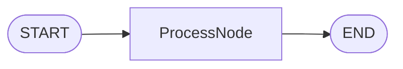
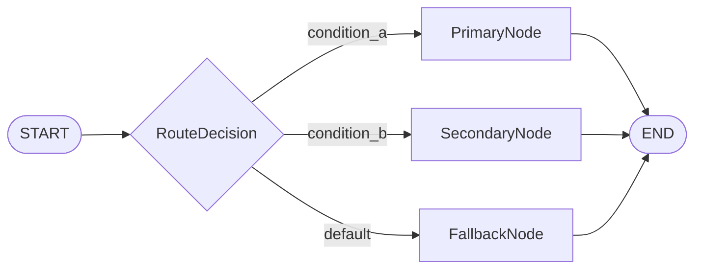
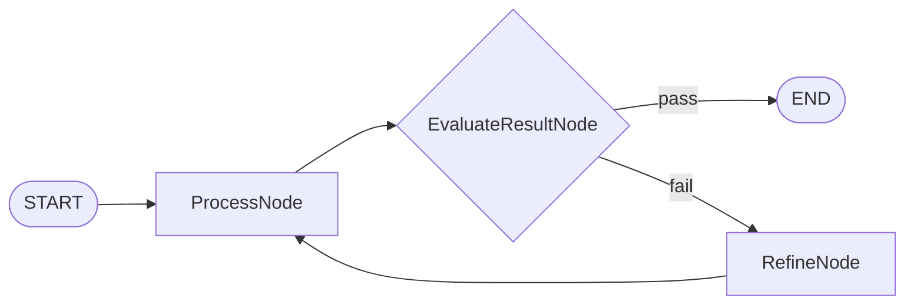
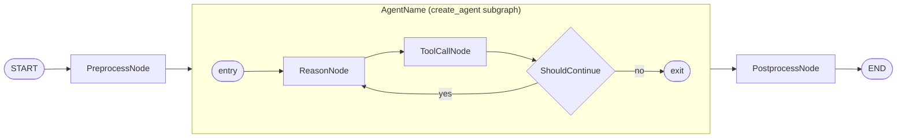
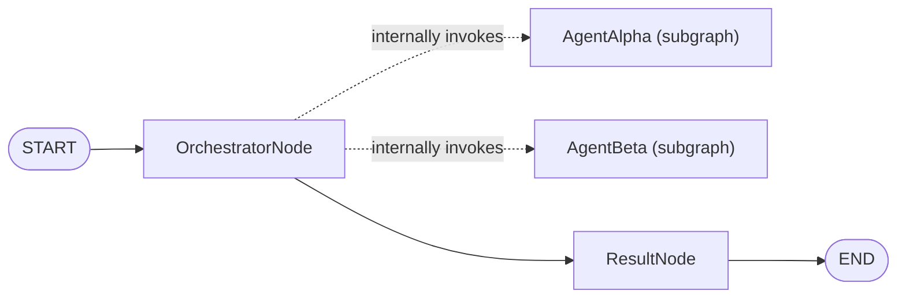
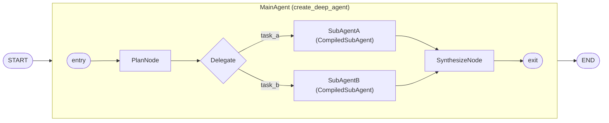

# Architecture Diagram Guide

Guide for creating clear Mermaid diagrams that represent your Cast architecture.

## Design Process

1. Start with START node
2. Add nodes based on selected pattern
3. Connect nodes with edges (normal or conditional)
4. Ensure all paths reach END
5. Add exit conditions for loops

## Mermaid Syntax

### Basic Structure

### Conditional Routing

### Loops

## Node Shapes

| Node Type | Description | Mermaid Syntax |
|-----------|-------------|----------------|
| **START/END** | Main-Graph initial start/final end. Use an Internal Connector if it serves as an entry point for a subgraph. | `([START])`, `([END])` |
| **Process Node** | Core function/feature nodes in the graph | `[Node Name]` |
| **Condition / Route Function** | Decision point when internal events or triggers occur - Router, Branch out, IF Function, etc | `{Condition / Route Function Name}` |
| **Agent Subgraph** | A `create_agent` or `create_deep_agent` subgraph used as a node | `subgraph Name["Label (subgraph)"]` |
| **Subgraph Entry/Exit** | Internal connectors for subgraph boundaries | `([entry])`, `([exit])` |
| **Internal Invocation** | A node internally invoking a subgraph (Strategy B) | `-.->` (dotted arrow) |

### Agent Subgraph as Node (Strategy A)

### Node Internally Invoking Subgraph (Strategy B)

### DeepAgent with CompiledSubAgent (Strategy D)

## Design Principles

**Clarity:** Each node should be clearly labeled with CamelCase names

**Completeness:** All paths must reach END

**Loops:** Must show exit condition and loop path

**Conditionals:** Label edges with conditions (e.g., `|condition|`)

## Checklist

- [ ] START node present
- [ ] All nodes connected
- [ ] All paths reach END
- [ ] Conditional edges labeled with conditions
- [ ] Loop exit conditions shown
- [ ] Node names use CamelCase