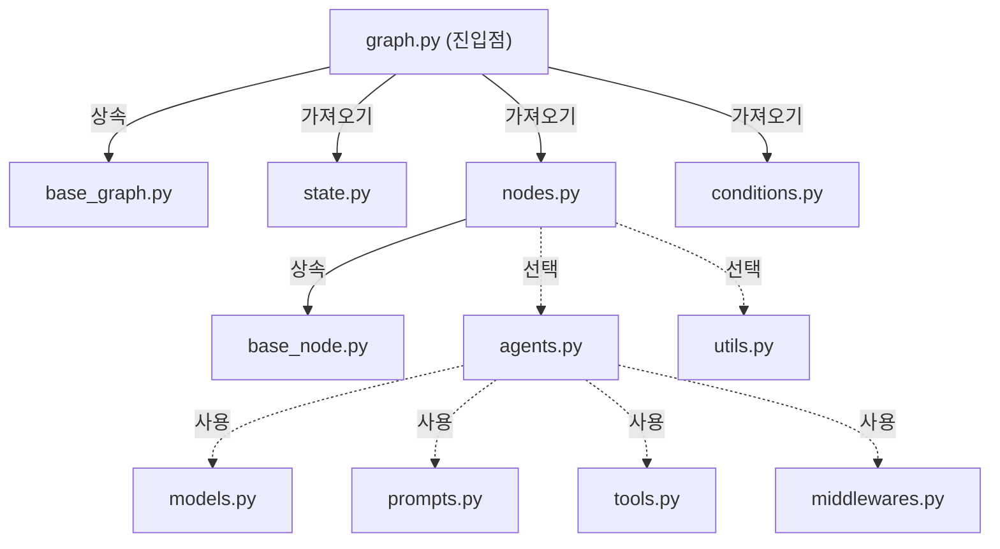
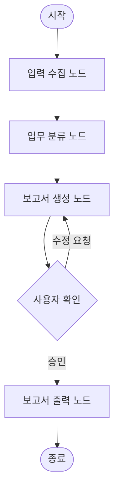

# 1주차: 환경 구축 및 아키텍처 설계 (Setup & Architecting)

> **목표**: Act Operator의 프로젝트 구조(Act vs Cast)를 이해하고, AI와 협업하여 첫 번째 그래프 아키텍처를 설계합니다.

---

## 📋 학습 체크리스트

- [ ] Step 1: 개발 환경 준비
- [ ] Step 2: Act Operator 설치 및 프로젝트 생성
- [ ] Step 3: Act vs Cast 개념 이해
- [ ] Step 4: 프로젝트 폴더 구조 분석
- [ ] Step 5: 모듈 의존성 이해
- [ ] Step 6: AI 설계 협업 — architecting-act 스킬
- [ ] Step 7: 실습 과제 — "주간 업무 보고서 작성기" Cast 설계
- [ ] 마무리: 복습 퀴즈

---

## Step 1: 개발 환경 준비

### 1.1 필수 소프트웨어

| 소프트웨어 | 최소 버전 | 설치 확인 명령어 |
|:---:|:---:|:---:|
| Python | 3.11+ | `python --version` |
| uv | 최신 | `uv --version` |
| Git | 최신 | `git --version` |

### 1.2 uv 설치

`uv`는 Rust로 작성된 초고속 Python 패키지 매니저입니다. pip보다 10~100배 빠릅니다.

```bash
# Windows (PowerShell)
powershell -ExecutionPolicy ByPass -c "irm https://astral.sh/uv/install.ps1 | iex"

# macOS / Linux
curl -LsSf https://astral.sh/uv/install.sh | sh
```

설치 확인:

```bash
uv --version
```

### 1.3 AI 코딩 도구 (선택)

Act Operator는 AI와의 협업을 위해 Claude Code를 권장하지만, 다른 AI 도구도 사용할 수 있습니다.

| 도구 | 스킬 디렉터리 |
|:---:|:---:|
| Claude Code | `.claude/skills/` (기본 내장) |
| Cursor | `.cursor/skills/` (디렉터리명 변경 필요) |
| Gemini CLI | `.gemini/skills/` (디렉터리명 변경 필요) |

---

## Step 2: Act Operator 설치 및 프로젝트 생성

### 2.1 새 프로젝트 생성

`uvx`는 패키지를 임시 환경에 설치하고 바로 실행하는 명령어입니다.

```bash
uvx --from act-operator act new
```

실행하면 대화형 프롬프트가 나타납니다:

```
? 경로 : .          ← 현재 디렉터리에 생성 (또는 새 경로 입력)
? Act 이름: my_project    ← 프로젝트(Act) 이름
? Cast 이름: weekly_report ← 첫 번째 워크플로우(Cast) 이름
```

> [!TIP]
> 경로에 `.`을 입력하면 현재 디렉터리에 프로젝트가 생성됩니다. 새 폴더명을 입력하면 해당 이름의 디렉터리가 생성됩니다.

### 2.2 의존성 설치 (동기화)

프로젝트 디렉터리로 이동한 뒤 의존성을 설치합니다:

```bash
cd my_project
uv sync
```

`uv sync`는 `pyproject.toml`에 정의된 모든 의존성을 설치하고, 가상 환경(`.venv/`)을 자동으로 생성합니다.

### 2.3 설치 확인

```bash
# 개발 서버 실행이 되는지 확인
uv run langgraph dev
```

> [!NOTE]
> LangGraph Studio가 `http://localhost:8000`에서 열리면 정상입니다. 아직 그래프를 구현하지 않았으므로 에러가 발생할 수 있으며, 이 단계에서는 환경이 정상적으로 구성되었는지만 확인하면 됩니다.

---

## Step 3: Act vs Cast 개념 이해

Act Operator의 핵심은 **Act**와 **Cast**라는 두 가지 개념입니다.

### 3.1 Act (전체 프로젝트 = 모노레포)

- 하나의 **Act**는 전체 프로젝트를 의미합니다
- 여러 개의 Cast를 포함하는 **모노레포(Monorepo)** 구조입니다
- 루트 `pyproject.toml`에서 공유 의존성을 관리합니다

### 3.2 Cast (개별 워크플로우 = 패키지)

- 하나의 **Cast**는 독립적인 워크플로우(그래프)입니다
- 각 Cast는 `casts/` 디렉터리 아래에 독립된 패키지로 존재합니다
- 자체 `pyproject.toml`로 개별 의존성을 관리합니다

### 3.3 비유로 이해하기

```
🎬 Act = 영화 한 편 (전체 프로젝트)
   🎭 Cast = 배우/역할 (개별 워크플로우)
   
   하나의 영화(Act)에 여러 배우(Cast)가 각자의 역할을 수행하듯,
   하나의 프로젝트(Act)에 여러 워크플로우(Cast)가 각자의 작업을 처리합니다.
```

### 3.4 실전 예시

| 구분 | Act (프로젝트) | Cast (워크플로우) |
|:---:|:---:|:---:|
| 고객 서비스 시스템 | `customer-service` | `chatbot`, `ticket-classifier`, `email-responder` |
| 데이터 파이프라인 | `data-pipeline` | `ingestion`, `transformation`, `reporting` |
| 콘텐츠 생성기 | `content-creator` | `weekly-report`, `newsletter`, `social-media` |

> [!IMPORTANT]
> **핵심 요약**: **Act = 모노레포 (전체 프로젝트)**, **Cast = 패키지 (개별 워크플로우)**

---

## Step 4: 프로젝트 폴더 구조 분석

`act new` 명령어로 생성된 프로젝트 구조를 살펴봅시다:

### 4.1 전체 디렉터리 구조

```
my_project/                    ← Act (모노레포 루트)
├── .claude/
│   └── skills/                ← AI 스킬 (AI 협업 가이드)
│       ├── architecting-act/  ← 아키텍처 설계 스킬
│       │   ├── resources/     ← 디자인 패턴, 질문, 결정 매트릭스
│       │   ├── scripts/       ← 아키텍처 검증 스크립트
│       │   └── templates/     ← CLAUDE.md 생성 템플릿
│       ├── developing-cast/   ← 구현 패턴 스킬
│       │   └── resources/     ← 50개 이상의 LangGraph 패턴
│       └── testing-cast/      ← 테스팅 스킬
│           └── resources/     ← 모킹, 픽스처, 커버리지 가이드
├── casts/                     ← Cast들의 상위 디렉터리
│   ├── base_node.py           ← 모든 노드의 베이스 클래스
│   ├── base_graph.py          ← 모든 그래프의 베이스 클래스
│   └── weekly_report/         ← Cast 패키지 (생성 시 지정한 이름)
│       ├── modules/           ← 핵심 모듈 디렉터리
│       │   ├── state.py       ← [필수] 상태 스키마 정의
│       │   ├── nodes.py       ← [필수] 노드 구현
│       │   ├── agents.py      ← [선택] 에이전트 설정
│       │   ├── tools.py       ← [선택] 도구 정의
│       │   ├── models.py      ← [선택] LLM 모델 설정
│       │   ├── conditions.py  ← [선택] 라우팅 조건
│       │   ├── middlewares.py ← [선택] 미들웨어
│       │   ├── prompts.py     ← [선택] 프롬프트 템플릿
│       │   └── utils.py       ← [선택] 헬퍼 함수
│       ├── graph.py           ← 그래프 조립 (진입점)
│       └── pyproject.toml     ← Cast별 의존성
├── tests/
│   ├── cast_tests/            ← 그래프 통합 테스트
│   └── node_tests/            ← 노드 단위 테스트
├── langgraph.json             ← LangGraph 진입점 (그래프 등록)
├── pyproject.toml             ← 모노레포 설정 (공유 의존성)
└── README.md
```

### 4.2 핵심 파일 역할 요약

| 파일 | 위치 | 역할 | 필수 여부 |
|:---:|:---:|---|:---:|
| `state.py` | `modules/` | TypedDict로 그래프 상태 스키마 정의 | ✅ 필수 |
| `nodes.py` | `modules/` | BaseNode 상속한 노드 클래스 구현 | ✅ 필수 |
| `graph.py` | Cast 루트 | BaseGraph 상속, 노드와 엣지를 조립 | ✅ 필수 |
| `agents.py` | `modules/` | LLM 에이전트 생성 및 도구 연결 | 선택 |
| `tools.py` | `modules/` | @tool 데코레이터로 도구 정의 | 선택 |
| `conditions.py` | `modules/` | 조건부 분기 로직 | 선택 |
| `middlewares.py` | `modules/` | before/after 라이프사이클 훅 | 선택 |
| `prompts.py` | `modules/` | 프롬프트 템플릿 | 선택 |

> [!TIP]
> `state.py` → `nodes.py` → `graph.py` 이 세 파일이 가장 핵심입니다. 이 세 파일만으로도 기본적인 그래프를 만들 수 있습니다.

---

## Step 5: 모듈 의존성 이해

Cast 내부 모듈들이 어떻게 연결되는지 이해하는 것이 중요합니다.

### 5.1 의존성 다이어그램



### 5.2 실행 흐름

```
1. graph.py        → InputState로 State 초기화
2.   ↳ nodes.py    → 각 노드의 execute() 메서드 순차 실행
3.     ↳ state.py  → 결과를 State에 병합
4. graph.py        → OutputState 추출 → 최종 결과 반환
```

### 5.3 범례

| 색상 | 의미 | 해당 파일 |
|:---:|:---:|:---:|
| 🟠 주황 | 진입점 | `graph.py` |
| 🔵 파랑 | 필수 모듈 | `state.py`, `nodes.py` |
| 🟢 초록 | 베이스 클래스 | `base_graph.py`, `base_node.py` |
| ⚫ 회색 | 선택적 모듈 | `agents.py`, `tools.py`, `middlewares.py` 등 |

---

## Step 6: AI 설계 협업 — `architecting-act` 스킬

### 6.1 스킬이란?

Act Operator에는 AI 에이전트가 프로젝트를 도와주는 **Agent Skills**가 내장되어 있습니다. 스킬은 `.claude/skills/` 디렉터리에 있는 지침 폴더로, AI가 프로젝트 관련 전문 기능을 수행할 수 있게 합니다.

### 6.2 architecting-act 스킬의 동작 방식

이 스킬을 활성화하면 AI는 **"스무고개" 방식**으로 질문하며 아키텍처를 설계합니다:

```
📋 AI의 질문 흐름 예시:

Q1: "이 워크플로우의 주된 목적이 무엇인가요?"
    → 답: "주간 업무 보고서를 자동 생성하고 싶어요"

Q2: "어떤 데이터 소스에서 정보를 가져오나요?"
    → 답: "Jira 태스크 목록, Slack 메시지, Git 커밋 로그"

Q3: "출력 형식은 어떤 것을 원하시나요?"
    → 답: "마크다운 보고서, 이메일 첨부용 PDF"

Q4: "사용자 승인 단계가 필요한가요?"
    → 답: "보고서 최종 발송 전에 검토가 필요해요"

    ... (필요한 만큼 질문 계속) ...
```

### 6.3 스킬의 3가지 모드

| 모드 | 용도 | 설명 |
|:---:|:---:|---|
| 모드 1 | **초기 설계** | `act new` 후 첫 번째 Cast 아키텍처 설계 |
| 모드 2 | **Cast 추가** | 기존 프로젝트에 새 Cast를 추가 |
| 모드 3 | **Sub-Cast 추출** | 복잡한 Cast에서 재사용 가능한 로직을 분리 |

### 6.4 CLAUDE.md — AI가 만드는 설계 명세서

스킬 실행 결과로 **CLAUDE.md** 파일이 생성됩니다. 이 파일은 AI와 개발자 모두가 참조하는 **프로젝트 설계 명세서**입니다.

CLAUDE.md는 분산 구조로 생성됩니다:

```
my_project/
├── CLAUDE.md                        ← 루트: Act 전체 개요
└── casts/
    └── weekly_report/
        └── CLAUDE.md                ← Cast별: 상세 명세
```

**루트 CLAUDE.md 포함 내용**:
- Act의 전체 목적과 개요
- 모든 Cast의 목록(테이블)
- 공유 의존성 정보

**Cast CLAUDE.md 포함 내용**:
- 아키텍처 다이어그램 (Mermaid)
- 상태 스키마 (State) 정의
- 노드와 엣지 목록
- 외부 의존성

### 6.5 스킬 사용 방법

Claude Code에서 스킬을 사용하는 것은 매우 간단합니다:

```
💬 사용자 프롬프트 예시:

"@architecting-act를 사용하여 주간 업무 보고서를 자동 생성하는 Cast를 설계해 줘.
 Jira, Slack, Git에서 데이터를 수집하고 마크다운 보고서를 만드는 거야."
```

> [!NOTE]
> 다른 AI 도구를 사용하는 경우, `.claude/skills/architecting-act/` 디렉터리의 내용을 직접 읽고 참고하여 설계를 진행할 수 있습니다.

---

## Step 7: 실습 과제 — "주간 업무 보고서 작성기"

### 7.1 과제 목표

| 항목 | 내용 |
|:---:|---|
| **Cast 이름** | `weekly_report` |
| **기능** | 한 주의 업무 데이터를 수집하여 보고서 생성 |
| **입력** | 업무 데이터 (수동 입력 또는 목업 데이터) |
| **출력** | 마크다운 형식의 주간 보고서 |

### 7.2 실습 순서

#### 과제 A: 프로젝트 생성

```bash
# 1. 실습용 디렉터리에서 프로젝트 생성
uvx --from act-operator act new

# 대화형 프롬프트:
#  경로: ./week1-practice
#  Act 이름: report_system
#  Cast 이름: weekly_report

# 2. 프로젝트 이동 및 의존성 설치
cd week1-practice
uv sync
```

#### 과제 B: 폴더 구조 확인

생성된 프로젝트가 Step 4에서 배운 구조와 일치하는지 확인합니다.

```bash
# 프로젝트 구조 확인 (Windows)
tree /F casts\weekly_report

# macOS / Linux
tree casts/weekly_report
```

다음 파일들이 존재하는지 체크하세요:

- [ ] `casts/weekly_report/modules/state.py`
- [ ] `casts/weekly_report/modules/nodes.py`
- [ ] `casts/weekly_report/graph.py`
- [ ] `casts/weekly_report/pyproject.toml`

#### 과제 C: AI에게 아키텍처 설계 요청

AI 코딩 도구에서 다음과 같이 요청합니다:

```
"@architecting-act를 사용해서, weekly_report Cast의 아키텍처를 설계해 줘.

요구사항:
- 사용자가 한 주의 업무 내용을 텍스트로 입력
- AI가 이를 분석하여 '완료 업무', '진행 중 업무', '다음 주 계획'으로 분류
- 마크다운 형식의 주간 보고서를 생성
- 보고서 생성 전 사용자 확인 단계 포함"
```

#### 과제 D: 생성 결과 검토

AI가 생성한 CLAUDE.md 파일을 열고 다음을 확인합니다:

1. **아키텍처 다이어그램**: 어떤 노드들이 정의되었는지?
2. **State 스키마**: 어떤 필드들이 상태에 포함되는지?
3. **노드 목록**: 각 노드가 어떤 역할을 하는지?
4. **데이터 흐름**: 입력 → 처리 → 출력의 흐름이 논리적인지?

### 7.3 예상 아키텍처 (참고용)



### 7.4 과제 제출 체크리스트

- [ ] 프로젝트가 정상적으로 생성되었는가?
- [ ] `uv sync`로 의존성이 설치되었는가?
- [ ] `modules/` 폴더의 파일 역할을 설명할 수 있는가?
- [ ] AI가 생성한 CLAUDE.md의 아키텍처 다이어그램을 이해하는가?
- [ ] Act와 Cast의 차이를 한 문장으로 설명할 수 있는가?

---

## 🧠 복습 퀴즈

### Q1. Act와 Cast의 관계

다음 중 Act와 Cast의 관계를 가장 잘 설명한 것은?

<details>
<summary>보기</summary>

A. Act는 함수이고, Cast는 변수이다  
B. Act는 모노레포(전체 프로젝트)이고, Cast는 패키지(개별 워크플로우)이다  
C. Act는 테스트이고, Cast는 구현 코드이다  
D. Act는 Cast의 별칭이다

<details>
<summary>정답</summary>

**B.** Act는 모노레포(전체 프로젝트)이고, Cast는 패키지(개별 워크플로우)이다.

하나의 Act 안에 여러 Cast가 독립적인 패키지로 존재합니다.
</details>
</details>

### Q2. 필수 파일

Cast에서 반드시 존재해야 하는 3개의 핵심 파일은?

<details>
<summary>정답</summary>

1. `state.py` — 그래프 상태 스키마 정의
2. `nodes.py` — 노드 비즈니스 로직 구현
3. `graph.py` — 노드와 엣지를 조립하는 진입점
</details>

### Q3. 명령어 구분

다음 명령어의 역할을 설명하세요:

| 명령어 | 역할 |
|:---:|:---:|
| `uvx --from act-operator act new` | ? |
| `uv sync` | ? |
| `uv run act cast` | ? |
| `uv run langgraph dev` | ? |

<details>
<summary>정답</summary>

| 명령어 | 역할 |
|:---:|---|
| `uvx --from act-operator act new` | 새 Act 프로젝트 생성 (스캐폴딩) |
| `uv sync` | pyproject.toml 기반 의존성 설치 및 가상환경 동기화 |
| `uv run act cast` | 기존 Act에 새로운 Cast(워크플로우) 추가 |
| `uv run langgraph dev` | LangGraph 개발 서버 실행 (localhost:8000) |
</details>

### Q4. architecting-act 스킬

`architecting-act` 스킬을 사용하면 AI가 어떤 파일을 생성하나요? 그 파일이 포함하는 정보 3가지를 적으세요.

<details>
<summary>정답</summary>

**CLAUDE.md** 파일을 생성합니다. (루트 + Cast별)

포함 정보:
1. 아키텍처 다이어그램 (Mermaid 형식)
2. State 스키마 정의 (TypedDict 필드 목록)
3. 노드 및 엣지 목록과 각 노드의 역할 설명
</details>

---

## 📚 참고 자료

- [Act Operator README (한국어)](../README_KR.md)
- [Act Operator README (영어)](../README.md)
- [CONTRIBUTING 가이드 (한국어)](../CONTRIBUTING_KR.md)
- [uv 공식 문서](https://docs.astral.sh/uv/)
- [LangGraph 공식 문서](https://langchain-ai.github.io/langgraph/)

---

## 다음 주차 예고

> **2주차: 핵심 로직 구현과 v1 패턴 적용**에서는 실제로 `state.py`, `nodes.py`, `tools.py`를 구현하고 LangChain v1의 `create_agent` 패턴을 활용하여 동작하는 그래프를 만듭니다.
