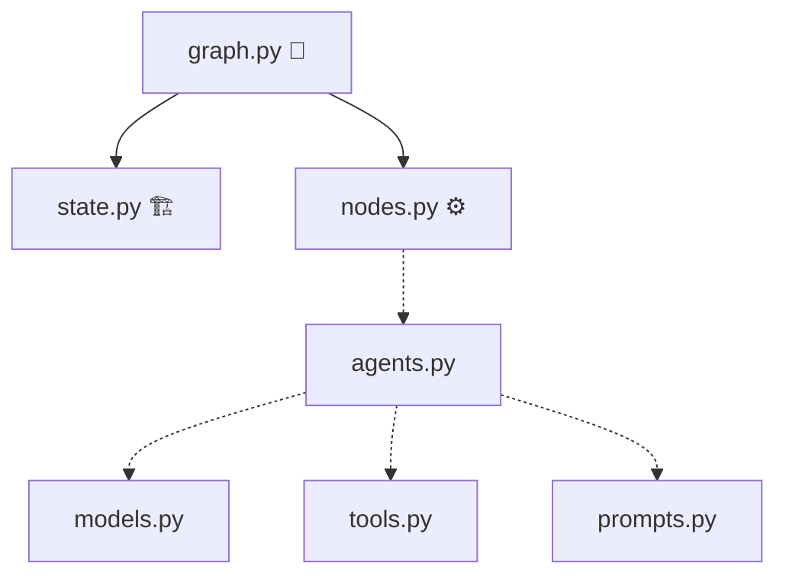
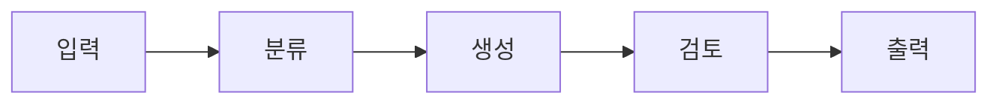

# Act Operator 1주차: 환경 구축 및 아키텍처 설계

## 📊 소스 분석 요약

- **핵심 주제**: Act Operator 환경 구축, Act vs Cast 아키텍처, AI 기반 설계 협업
- **핵심 메시지**: "Act = 모노레포, Cast = 패키지" 구조를 이해하면 AI와 함께 즉시 설계 가능
- **대상 청중**: Act Operator를 처음 접하는 개발자 (초중급)
- **포맷**: Presenter Slides
- **총 슬라이드 수**: 10장
- **예상 발표 시간**: 약 10분

---

## 🎨 디자인 컨셉: Friendly Learning

**컨셉 요약**: 교육 콘텐츠를 직관적 시각 요소와 밝은 색감으로 전달하는 친근한 학습 스타일

### 색상 팔레트

| 용도 | 색상 | HEX |
|:---:|---|---|
| 배경 | ██ 화이트 | `#FFFFFF` |
| 텍스트 | ██ 차콜 | `#2D3436` |
| 강조 | ██ 소프트 블루 | `#0984E3` |
| 서브 강조 | ██ 코랄 | `#FF7043` |
| 배경 (Sub) | ██ 연한 블루 | `#E3F2FD` |

### 타이포그래피

| 용도 | 폰트 | 크기 |
|:---:|---|---|
| 제목 | Nunito Bold | 44pt |
| 부제 | Nunito SemiBold | 28pt |
| 본문 | Pretendard | 18pt |
| 코드 | Fira Code | 16pt |

### 레이아웃

- 여백 60px, 좌측 정렬, 둥근 모서리 12px, 듀오톤 아이콘

---

## 📝 슬라이드 스크립트

---

### 슬라이드 1: 타이틀

**슬라이드 내용**
- **1주차: 환경 구축 및 아키텍처 설계**
- Setup & Architecting
- Act Operator로 AI 에이전트 개발을 시작합니다

**시각적 제안**
- 중앙 정렬 타이틀, 연한 블루 그라디언트 배경, 🚀 아이콘

---

### 슬라이드 2: 어젠다

**슬라이드 내용**
- ① 개발 환경 준비 (Python, uv, Git)
- ② Act Operator 설치
- ③ Act vs Cast 핵심 개념
- ④ 프로젝트 구조 분석
- ⑤ 모듈 의존성 이해
- ⑥ AI 설계 협업 (architecting-act)
- ⑦ 실습 과제

**시각적 제안**
- 번호 리스트 + 듀오톤 아이콘, 현재 스텝 블루 하이라이트

---

### 슬라이드 3: 30초 만에 시작하기

**슬라이드 내용**
- 필수 환경: **Python 3.11+** · **uv** · **Git**
- 프로젝트 생성 2개 명령어:

```bash
uvx --from act-operator act new
uv sync
```

**시각적 제안**
- 3열 아이콘(🐍⚡Git) 상단 + 터미널 스타일 코드 블록 하단

---

### 슬라이드 4: Act vs Cast

**슬라이드 내용**
- **Act** = 🎬 영화 한 편 (전체 프로젝트 · 모노레포)
- **Cast** = 🎭 배우 역할 (개별 워크플로우 · 패키지)

| Act (프로젝트) | Cast (워크플로우) |
|:---:|---|
| 고객 서비스 | `chatbot`, `ticket-classifier` |
| 데이터 파이프라인 | `ingestion`, `reporting` |
| 콘텐츠 생성 | `weekly-report`, `newsletter` |

**시각적 제안**
- 상단 좌우 2분할(Act|Cast) + 하단 예시 테이블, 영화 비유 일러스트

---

### 슬라이드 5: 프로젝트 폴더 구조

**슬라이드 내용**

```
my_project/
├── .claude/skills/     ← 🤖 AI 스킬
├── casts/
│   └── my_cast/
│       ├── modules/
│       │   ├── state.py   ← 상태
│       │   ├── nodes.py   ← 로직
│       │   └── ...
│       └── graph.py       ← 조립
├── langgraph.json
└── pyproject.toml
```

**시각적 제안**
- 파일 트리 중앙, 주요 파일에 컬러 라벨(블루/오렌지)

---

### 슬라이드 6: 핵심 3개 파일

**슬라이드 내용**
- **state.py** — 🏗️ "무엇이 흐르는가" (데이터 스키마)
- **nodes.py** — ⚙️ "무엇을 하는가" (비즈니스 로직)
- **graph.py** — 🔗 "어떻게 연결하는가" (조립)

> 이 세 파일만으로 동작하는 그래프를 만들 수 있습니다

**시각적 제안**
- 3열 카드, 각 카드에 이모지+한줄 설명, 하단에 코랄 강조 문구

---

### 슬라이드 7: 모듈 의존성

**슬라이드 내용**



- 실선 = 필수 / 점선 = 선택적

**시각적 제안**
- 다이어그램 중앙, 필수 노드는 블루, 선택 노드는 회색

---

### 슬라이드 8: AI 스킬 — architecting-act

**슬라이드 내용**
- AI가 **"스무고개"** 방식으로 질문하며 아키텍처 설계
- 입력: 요구사항 → 출력: **CLAUDE.md** (설계 명세서)
- 포함: 아키텍처 다이어그램, 상태 스키마, 노드 목록

**시각적 제안**
- 좌측 대화 UI(말풍선) + 우측 CLAUDE.md 미리보기 카드

---

### 슬라이드 9: 실습 — 주간 보고서 작성기

**슬라이드 내용**
- **Cast 이름**: `weekly_report`
- **기능**: 업무 데이터 → 분류 → 보고서 생성



**시각적 제안**
- 플로우차트 중앙, 노드마다 이모지(📥📂📝👀📤), "검토"에 코랄 강조

---

### 슬라이드 10: Key Takeaways

**슬라이드 내용**
1. **Act = 모노레포**, Cast = 패키지 (독립 워크플로우)
2. 핵심 파일 3개: `state.py` → `nodes.py` → `graph.py`
3. `uvx act new` + `uv sync`로 30초 만에 시작
4. AI 스킬(`architecting-act`)로 설계 자동화
5. CLAUDE.md가 AI와 개발자의 **공유 설계도**

**시각적 제안**
- 번호 리스트, 블루 서클 번호, 키워드 볼드, 연한 블루 배경
