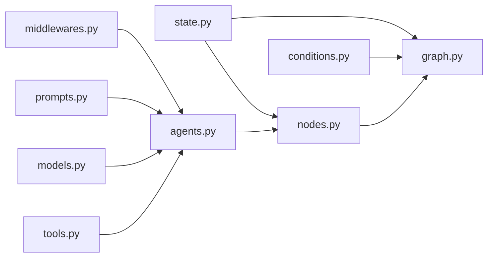
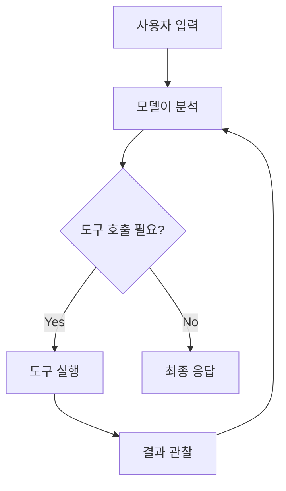

# 2주차: 핵심 로직 구현과 v1 패턴 적용 (Implementation & LangChain v1)

> **목표**: LangChain v1의 새로운 패턴인 `create_agent`를 활용하여 비즈니스 로직을 구현합니다.

---

## 📋 학습 체크리스트

- [ ] Step 1: `developing-cast` 스킬 이해
- [ ] Step 2: 구현 순서와 워크플로우 파악
- [ ] Step 3: State 정의 (`state.py`)
- [ ] Step 4: 도구 구현 (`tools.py`)
- [ ] Step 5: 모델 설정 (`models.py`)
- [ ] Step 6: 프롬프트 작성 (`prompts.py`)
- [ ] Step 7: 에이전트 구성 (`agents.py`) — `create_agent` 패턴
- [ ] Step 8: 노드 구현 (`nodes.py`)
- [ ] Step 9: 그래프 조립 (`graph.py`)
- [ ] Step 10: 실습 과제 — 검색 도구 + 답변 생성 노드
- [ ] 마무리: 복습 퀴즈

---

## Step 1: `developing-cast` 스킬 이해

### 1.1 스킬이란?

`developing-cast`는 CLAUDE.md에 정의된 아키텍처 명세를 **실제 코드로 변환**하는 AI 스킬입니다. 1주차에서 `architecting-act`로 설계한 결과물을 구현하는 단계입니다.

### 1.2 스킬 사용법

```
💬 AI에게 요청 예시:

"@developing-cast를 사용하여 weekly_report Cast를 구현해 줘"
```

스킬이 활성화되면 AI는 다음을 자동으로 수행합니다:
1. `/CLAUDE.md` → Act 전체 개요 확인
2. `/casts/{cast_name}/CLAUDE.md` → Cast 상세 명세 확인
3. 명세 기반으로 코드 순차 생성

### 1.3 스킬의 리소스 구조

`developing-cast` 스킬에는 **50개 이상의 구현 패턴**이 리소스로 포함되어 있습니다:

| 카테고리 | 리소스 파일 | 설명 |
|:---:|:---:|---|
| Core | `state.md`, `node.md`, `edge.md`, `graph.md` | 핵심 컴포넌트 패턴 |
| Agents | `configuration.md`, `structured-output.md` | 에이전트 구성 패턴 |
| Tools | `basic-tool.md`, `access-context.md` | 도구 정의 패턴 |
| Models | `select-chat-models.md`, `standalone-model.md` | LLM 모델 설정 |
| Memory | `add-to-agent.md`, `manage-conversations.md` | 메모리 관리 |
| Middleware | `human-in-the-loop.md`, `summarization.md` 등 | 미들웨어 패턴 |

---

## Step 2: 구현 순서와 워크플로우

### 2.1 정해진 구현 순서 (매우 중요!)

`developing-cast` 스킬은 반드시 아래 순서로 구현합니다:

```
1. state.py           ← 🏗️ 기초 (상태 스키마)
   ↓
2. 의존성 모듈들       ← 🔧 부품 (tools, models, prompts, agents, middlewares)
   ↓
3. nodes.py           ← ⚙️ 핵심 로직 (비즈니스 로직)
   ↓
4. conditions.py      ← 🔀 분기 (선택적)
   ↓
5. graph.py           ← 🏭 조립 (모든 것을 연결)
```

> [!IMPORTANT]
> 이 순서를 지키는 이유: 각 모듈이 이전 모듈에 의존하기 때문입니다. `nodes.py`는 `state.py`의 스키마를 알아야 하고, `graph.py`는 모든 노드를 알아야 합니다.

### 2.2 모듈 간 의존 관계



---

## Step 3: State 정의 (`state.py`)

State는 그래프의 **데이터 흐름을 정의하는 스키마**입니다. 모든 노드는 State를 읽고, State에 결과를 씁니다.

### 3.1 기본 State 구조

```python
# casts/{cast_name}/modules/state.py
from typing_extensions import TypedDict

class State(TypedDict):
    input: str     # 입력 데이터
    output: str    # 출력 데이터
```

### 3.2 세 가지 State 클래스

Act Operator는 **InputState**, **OutputState**, **State** 세 가지를 분리하여 정의합니다:

```python
# casts/{cast_name}/modules/state.py
from langgraph.graph import MessagesState
from typing_extensions import TypedDict


class InputState(TypedDict):
    """그래프가 외부에서 받는 입력."""
    query: str


class OutputState(TypedDict):
    """그래프가 외부로 내보내는 출력."""
    result: str


class State(MessagesState):
    """그래프 내부에서 사용하는 전체 상태.
    MessagesState를 상속하면 messages 필드가 자동 포함됩니다.
    """
    # messages 필드는 MessagesState에서 상속
    # messages: Annotated[list[AnyMessage], add_messages]
    query: str
    result: str
```

### 3.3 왜 세 가지로 나누는가?

```
외부 사용자     ──InputState──▶  [그래프 내부: State]  ──OutputState──▶  외부 사용자
(query만 전달)                   (query + messages      (result만 반환)
                                  + result + ...)
```

| 클래스 | 역할 | 포함 필드 |
|:---:|:---:|---|
| `InputState` | 외부에서 그래프로 전달되는 입력 | 최소한의 입력 필드만 |
| `OutputState` | 그래프에서 외부로 반환되는 출력 | 최소한의 출력 필드만 |
| `State` | 그래프 내부에서 노드 간 공유되는 전체 상태 | 모든 필드 (InputState + OutputState + 내부 전용) |

### 3.4 Reducer — 상태 업데이트 방식

Reducer는 노드가 상태를 업데이트할 때 **어떻게 병합할지** 결정합니다:

```python
from typing import Annotated
from typing_extensions import TypedDict
from operator import add

class State(TypedDict):
    count: int                              # Reducer 없음 → 덮어쓰기
    items: Annotated[list[str], add]        # add → 리스트에 추가
```

| Reducer | 동작 | 예시 |
|:---:|---|---|
| 없음 (기본) | 새 값으로 **덮어쓰기** | `count: 1` → `count: 2` |
| `operator.add` | 리스트에 **추가** | `["a"]` → `["a", "b"]` |
| `add_messages` | 메시지를 **ID 기반 병합** | 동일 ID면 업데이트, 새 ID면 추가 |

> [!TIP]
> `MessagesState`를 상속하면 `messages` 필드에 `add_messages` reducer가 자동 적용됩니다. 메시지 기반 그래프에서 가장 흔한 패턴입니다.

---

## Step 4: 도구 구현 (`tools.py`)

도구(Tool)는 에이전트가 **외부 세계와 상호작용**하는 수단입니다. 웹 검색, DB 조회, API 호출 등을 도구로 정의합니다.

### 4.1 기본 도구 만들기

`@tool` 데코레이터로 간단하게 생성합니다:

```python
# casts/{cast_name}/modules/tools.py
from langchain.tools import tool


@tool
def search_database(query: str, limit: int = 10) -> str:
    """고객 데이터베이스에서 쿼리와 일치하는 레코드를 검색합니다.

    Args:
        query: 검색할 키워드
        limit: 반환할 최대 결과 수
    """
    return f"'{query}'에 대해 {limit}개의 결과를 찾았습니다"
```

### 4.2 도구 정의 규칙

| 규칙 | 설명 | 예시 |
|:---:|---|---|
| **타입 힌트 필수** | 파라미터의 타입을 반드시 명시 | `query: str` |
| **Docstring 필수** | 함수의 설명이 도구 설명이 됨 | `"""검색합니다..."""` |
| **Google 스타일** | Args 섹션으로 파라미터 설명 | `Args:\n    query: 키워드` |

### 4.3 커스텀 이름 지정

```python
@tool("web_search")          # 도구 이름을 직접 지정
def search(query: str) -> str:
    """웹에서 정보를 검색합니다."""
    return f"검색 결과: {query}"
```

### 4.4 Tavily 검색 도구 예시 (실습용)

```python
# casts/{cast_name}/modules/tools.py
from langchain.tools import tool


@tool
def tavily_search(query: str) -> str:
    """Tavily API를 사용하여 웹을 검색합니다.

    Args:
        query: 검색할 질문이나 키워드
    """
    # 실제 구현 시 TavilySearchResults 사용
    # from langchain_community.tools.tavily_search import TavilySearchResults
    # search = TavilySearchResults(max_results=3)
    # return search.invoke(query)
    return f"'{query}'에 대한 검색 결과입니다."
```

> [!NOTE]
> Tavily API를 실제로 사용하려면 `uv add --package {cast_slug} langchain-community tavily-python` 명령으로 패키지를 설치하고, `.env` 파일에 `TAVILY_API_KEY`를 설정해야 합니다.

---

## Step 5: 모델 설정 (`models.py`)

LLM 모델의 설정을 한 곳에서 관리합니다.

### 5.1 기본 모델 팩토리 함수

```python
# casts/{cast_name}/modules/models.py
from langchain_openai import ChatOpenAI


def get_chat_model():
    """OpenAI GPT-4o 모델을 반환합니다."""
    return ChatOpenAI(
        model="gpt-4o",
        temperature=0.1,     # 낮을수록 일관된 응답
        max_tokens=1000,     # 최대 출력 토큰 수
        timeout=30           # 타임아웃 (초)
    )
```

### 5.2 범용 모델 초기화 (`init_chat_model`)

프로바이더에 독립적인 방식:

```python
# casts/{cast_name}/modules/models.py
from langchain.chat_models import init_chat_model


def get_model():
    """프로바이더를 지정하여 모델을 초기화합니다."""
    return init_chat_model(
        model="gpt-4o",
        model_provider="openai",
    )
```

### 5.3 지원 프로바이더

| 프로바이더 | 패키지 | 설치 명령어 |
|:---:|:---:|---|
| OpenAI | `langchain-openai` | `uv add --package {cast} langchain-openai` |
| Anthropic | `langchain-anthropic` | `uv add --package {cast} langchain-anthropic` |
| Google | `langchain-google-genai` | `uv add --package {cast} langchain-google-genai` |

---

## Step 6: 프롬프트 작성 (`prompts.py`)

시스템 메시지, 사용자 메시지 등의 프롬프트 템플릿을 관리합니다.

### 6.1 딕셔너리 형식 (간결)

```python
# casts/{cast_name}/modules/prompts.py

def get_system_prompt():
    """시스템 프롬프트를 딕셔너리 형식으로 반환합니다."""
    return [
        {"role": "system", "content": "당신은 유능한 리서치 어시스턴트입니다."},
    ]
```

### 6.2 Message 객체 형식 (타입 안전)

```python
# casts/{cast_name}/modules/prompts.py
from langchain.messages import SystemMessage, HumanMessage, AIMessage


def get_system_prompt():
    """시스템 프롬프트를 Message 객체로 반환합니다."""
    return [
        SystemMessage("당신은 유능한 리서치 어시스턴트입니다."),
    ]
```

> [!TIP]
> 두 형식 모두 동작합니다. 딕셔너리 형식이 간결하고, Message 객체 형식이 타입 안전합니다. 프로젝트에서 일관되게 하나를 선택하세요.

---

## Step 7: 에이전트 구성 (`agents.py`) — `create_agent` 패턴

### 7.1 `create_agent` vs `create_react_agent` (v1 마이그레이션)

LangChain v1에서는 `create_react_agent` 대신 **`create_agent`**를 사용합니다:

```diff
# ❌ 기존 방식 (deprecated)
- from langchain.agents import create_react_agent

# ✅ 새로운 방식 (LangChain v1)
+ from langchain.agents import create_agent
```

### 7.2 `create_agent`의 구조

```python
from langchain.agents import create_agent

agent = create_agent(
    model=...,           # 필수: LLM 모델 인스턴스
    tools=[...],         # 선택: 사용할 도구 목록
    middleware=[...],    # 선택: 미들웨어 목록
    system_prompt=...,   # 선택: 시스템 프롬프트
    response_format=..., # 선택: 구조화된 출력 전략
    state_schema=...,    # 선택: 커스텀 상태 스키마
    context_schema=...,  # 선택: 런타임 컨텍스트 스키마
)
```

### 7.3 실전 에이전트 구현

모듈 분리 패턴을 따라 구현합니다:

```python
# casts/{cast_name}/modules/agents.py
from langchain.agents import create_agent
from .models import get_chat_model
from .tools import tavily_search


def set_search_agent():
    """검색 도구를 사용하는 에이전트를 생성합니다."""
    return create_agent(
        model=get_chat_model(),
        tools=[tavily_search],
        system_prompt="당신은 웹 검색을 통해 정보를 찾아주는 리서치 어시스턴트입니다."
    )
```

### 7.4 에이전트 실행 흐름 (ReAct 패턴)

`create_agent`는 내부적으로 **ReAct 루프**를 실행합니다:

```
사용자 입력
    ↓
┌─────────────────────────────┐
│  1. 모델이 상황 분석 (Reason) │
│  2. 도구 호출 결정 (Act)      │
│  3. 도구 실행 → 결과 관찰      │
│  4. 충분하면 종료, 부족하면 반복 │
└─────────────────────────────┘
    ↓
최종 응답
```



---

## Step 8: 노드 구현 (`nodes.py`)

### 8.1 BaseNode 상속 패턴

모든 노드는 `BaseNode`(동기) 또는 `AsyncBaseNode`(비동기)를 상속합니다:

```python
# casts/{cast_name}/modules/nodes.py
from casts.base_node import BaseNode, AsyncBaseNode
```

### 8.2 `execute()` 메서드 시그니처

노드의 핵심은 `execute()` 메서드입니다. 필요에 따라 4가지 시그니처 중 선택합니다:

```python
# 시그니처 옵션 (필요한 것만 선택)
def execute(self, state):                        # 상태만 필요
def execute(self, state, config):                # + thread_id, tags
def execute(self, state, runtime):               # + store, stream
def execute(self, state, config, runtime):       # 모든 것 필요
```

### 8.3 간단한 노드 예시

```python
# casts/{cast_name}/modules/nodes.py
from langchain_core.messages import AIMessage
from casts.base_node import BaseNode


class GreetingNode(BaseNode):
    """사용자에게 인사하는 간단한 노드."""

    def __init__(self):
        super().__init__()

    def execute(self, state):
        query = state.get("query", "")
        return {
            "messages": [AIMessage(content=f"안녕하세요! '{query}'에 대해 알아보겠습니다.")],
            "result": f"인사 완료: {query}"
        }
```

### 8.4 에이전트를 사용하는 노드

에이전트를 노드 안에서 호출하는 패턴입니다:

```python
# casts/{cast_name}/modules/nodes.py
from casts.base_node import BaseNode
from .agents import set_search_agent


class SearchNode(BaseNode):
    """검색 에이전트를 호출하는 노드."""

    def __init__(self):
        super().__init__()
        self.agent = set_search_agent()    # 에이전트를 초기화 시 생성

    def execute(self, state):
        result = self.agent.invoke({
            "messages": [{"role": "user", "content": state["query"]}]
        })
        return {"messages": result["messages"]}
```

### 8.5 verbose 모드 — 디버깅

```python
class DebugNode(BaseNode):
    def __init__(self):
        super().__init__(verbose=True)     # 디버그 로깅 활성화

    def execute(self, state):
        self.log("Processing", input=state.get("query"))   # verbose=True일 때만 출력
        return {"result": "완료"}
```

### 8.6 노드의 핵심 규칙

> [!IMPORTANT]
> 1. `execute()`는 반드시 **dict를 반환**해야 합니다 (State 업데이트용)
> 2. 반환된 dict의 키는 **State에 정의된 필드**와 일치해야 합니다
> 3. 노드를 그래프에 등록할 때는 **인스턴스**를 전달합니다 (클래스가 아님!)

---

## Step 9: 그래프 조립 (`graph.py`)

### 9.1 BaseGraph 상속 패턴

```python
# casts/{cast_name}/graph.py
from langgraph.graph import StateGraph, START, END
from casts.base_graph import BaseGraph
from casts.{cast_name}.modules.state import InputState, OutputState, State
from casts.{cast_name}.modules.nodes import GreetingNode, SearchNode
```

### 9.2 기본 그래프 구현

```python
class MyGraph(BaseGraph):
    """Cast의 메인 그래프."""

    def __init__(self):
        super().__init__()
        self.input = InputState
        self.output = OutputState
        self.state = State

    def build(self):
        """그래프를 빌드하고 컴파일합니다."""

        # 1️⃣ StateGraph 생성 (스키마 지정)
        builder = StateGraph(
            self.state,
            input_schema=self.input,
            output_schema=self.output
        )

        # 2️⃣ 노드 등록 (반드시 인스턴스!)
        builder.add_node("greeting", GreetingNode())
        builder.add_node("search", SearchNode())

        # 3️⃣ 엣지 연결
        builder.add_edge(START, "greeting")       # 시작 → 인사
        builder.add_edge("greeting", "search")    # 인사 → 검색
        builder.add_edge("search", END)           # 검색 → 종료

        # 4️⃣ 컴파일 및 반환
        graph = builder.compile()
        graph.name = self.name
        return graph


# 그래프 인스턴스 생성 (langgraph.json에서 참조)
my_graph = MyGraph()
```

### 9.3 그래프 빌드 4단계 요약

| 단계 | 코드 | 설명 |
|:---:|---|---|
| 1 | `StateGraph(State, input_schema=..., output_schema=...)` | 상태 스키마로 그래프 생성 |
| 2 | `builder.add_node("name", NodeClass())` | **인스턴스**로 노드 등록 |
| 3 | `builder.add_edge(START, "first")` | 엣지로 노드 연결 |
| 4 | `builder.compile()` | 실행 가능한 그래프로 컴파일 |

### 9.4 조건부 엣지 (Conditional Edge)

분기 로직이 필요할 때:

```python
# casts/{cast_name}/modules/conditions.py
from langgraph.graph import END

def should_continue(state) -> str:
    """검색 결과 유무에 따라 분기합니다."""
    if state.get("result"):
        return "output"        # 결과 있으면 → output 노드
    return END                 # 결과 없으면 → 종료
```

```python
# graph.py의 build() 안에서
builder.add_conditional_edges(
    "search",                  # 출발 노드
    should_continue,           # 분기 함수
    {"output": "output_node", END: END}  # 반환값 → 노드 매핑
)
```

### 9.5 흔한 실수 모음

| ❌ 실수 | ✅ 올바른 방법 |
|---|---|
| `add_node("n", MyNode)` 클래스 전달 | `add_node("n", MyNode())` **인스턴스** 전달 |
| `add_edge("START", "n")` 문자열 | `add_edge(START, "n")` **상수** 사용 |
| `class MyGraph:` | `class MyGraph(BaseGraph):` **상속** 필수 |
| `compile(interrupt_before=[...])` | `compile(checkpointer=..., interrupt_before=[...])` 체크포인터 필요 |

---

## Step 10: 실습 과제 — 검색 도구 + 답변 생성 노드

### 10.1 과제 목표

| 항목 | 내용 |
|:---:|---|
| **Cast 이름** | `smart_search` (또는 1주차에서 만든 Cast 재사용) |
| **기능** | 사용자 질문 → 검색 도구 호출 → 답변 생성 |
| **핵심 학습** | `state.py` → `tools.py` → `models.py` → `agents.py` → `nodes.py` → `graph.py` 순차 구현 |

### 10.2 구현 파일 순서

#### 📄 A. `state.py` — 상태 정의

```python
# casts/smart_search/modules/state.py
from langgraph.graph import MessagesState
from typing_extensions import TypedDict


class InputState(TypedDict):
    query: str


class OutputState(TypedDict):
    result: str


class State(MessagesState):
    query: str
    result: str
```

#### 📄 B. `tools.py` — 검색 도구

```python
# casts/smart_search/modules/tools.py
from langchain.tools import tool


@tool
def web_search(query: str) -> str:
    """웹에서 정보를 검색합니다.

    Args:
        query: 검색할 질문이나 키워드
    """
    # 학습 단계에서는 Mock 데이터 반환
    mock_results = {
        "파이썬": "파이썬은 1991년에 만들어진 범용 프로그래밍 언어입니다.",
        "LangChain": "LangChain은 LLM 기반 애플리케이션을 위한 프레임워크입니다.",
    }
    for key, value in mock_results.items():
        if key.lower() in query.lower():
            return value
    return f"'{query}'에 대한 검색 결과: 관련 정보를 찾았습니다."
```

#### 📄 C. `models.py` — 모델 설정

```python
# casts/smart_search/modules/models.py
from langchain_openai import ChatOpenAI


def get_chat_model():
    return ChatOpenAI(model="gpt-4o", temperature=0.1)
```

#### 📄 D. `agents.py` — 에이전트 구성

```python
# casts/smart_search/modules/agents.py
from langchain.agents import create_agent
from .models import get_chat_model
from .tools import web_search


def set_search_agent():
    return create_agent(
        model=get_chat_model(),
        tools=[web_search],
        system_prompt="당신은 웹 검색을 통해 정확한 정보를 제공하는 어시스턴트입니다."
    )
```

#### 📄 E. `nodes.py` — 노드 구현

```python
# casts/smart_search/modules/nodes.py
from langchain_core.messages import AIMessage
from casts.base_node import BaseNode
from .agents import set_search_agent


class InputNode(BaseNode):
    """사용자 입력을 처리하는 노드."""

    def execute(self, state):
        query = state.get("query", "")
        self.log("Received query", query=query)
        return {
            "messages": [{"role": "user", "content": query}]
        }


class SearchAgentNode(BaseNode):
    """검색 에이전트를 호출하는 노드."""

    def __init__(self):
        super().__init__(verbose=True)
        self.agent = set_search_agent()

    def execute(self, state):
        result = self.agent.invoke({
            "messages": state["messages"]
        })
        # 마지막 AI 메시지를 result에 저장
        last_message = result["messages"][-1]
        return {
            "messages": result["messages"],
            "result": last_message.content
        }
```

#### 📄 F. `graph.py` — 그래프 조립

```python
# casts/smart_search/graph.py
from langgraph.graph import StateGraph, START, END
from casts.base_graph import BaseGraph
from casts.smart_search.modules.state import InputState, OutputState, State
from casts.smart_search.modules.nodes import InputNode, SearchAgentNode


class SmartSearchGraph(BaseGraph):
    def __init__(self):
        super().__init__()
        self.input = InputState
        self.output = OutputState
        self.state = State

    def build(self):
        builder = StateGraph(
            self.state,
            input_schema=self.input,
            output_schema=self.output
        )

        builder.add_node("input", InputNode())
        builder.add_node("search", SearchAgentNode())

        builder.add_edge(START, "input")
        builder.add_edge("input", "search")
        builder.add_edge("search", END)

        graph = builder.compile()
        graph.name = self.name
        return graph


smart_search_graph = SmartSearchGraph()
```

### 10.3 실행 및 확인

```bash
# 의존성 설치 (OpenAI 패키지)
uv add --package smart_search langchain-openai

# 환경 변수 설정 (.env 파일)
echo "OPENAI_API_KEY=your_key_here" > .env

# 개발 서버 실행
uv run langgraph dev
```

### 10.4 과제 제출 체크리스트

- [ ] `state.py`에 InputState, OutputState, State를 정의했는가?
- [ ] `tools.py`에 `@tool` 데코레이터로 검색 도구를 구현했는가?
- [ ] `agents.py`에 `create_agent`로 에이전트를 구성했는가?
- [ ] `nodes.py`에 BaseNode를 상속한 노드를 구현했는가?
- [ ] `graph.py`에 노드를 **인스턴스**로 등록하고 엣지를 연결했는가?
- [ ] 구현 순서(state → tools → models → agents → nodes → graph)를 지켰는가?

---

## 🧠 복습 퀴즈

### Q1. 구현 순서

다음 중 올바른 구현 순서는?

<details>
<summary>보기</summary>

A. graph.py → nodes.py → state.py → tools.py  
B. state.py → tools.py/models.py → agents.py → nodes.py → graph.py  
C. nodes.py → state.py → graph.py → tools.py  
D. agents.py → tools.py → state.py → nodes.py → graph.py

<details>
<summary>정답</summary>

**B.** `state.py` → 의존성 모듈(`tools.py`, `models.py`) → `agents.py` → `nodes.py` → `graph.py`

State가 기초이고, graph.py가 모든 것을 조립하는 최종 단계입니다.
</details>
</details>

### Q2. `create_agent` vs `create_react_agent`

LangChain v1에서 `create_react_agent` 대신 사용해야 하는 함수와, 그 차이점을 설명하세요.

<details>
<summary>정답</summary>

**`create_agent`**를 사용합니다.

`create_agent`는 `create_react_agent`의 후속으로, 모델/도구/미들웨어/시스템 프롬프트/구조화된 출력 등을 하나의 함수에서 통합 관리합니다. `middleware` 파라미터를 통해 안정성(재시도, 폴백)과 안전성(가드레일, 승인) 기능을 선언적으로 추가할 수 있습니다.
</details>

### Q3. 노드 규칙

다음 코드에서 **2가지 오류**를 찾으세요:

```python
class MyGraph(BaseGraph):
    def build(self):
        builder = StateGraph(State)
        builder.add_node("process", ProcessNode)      # 🤔 무엇이 문제?
        builder.add_edge("START", "process")           # 🤔 무엇이 문제?
        builder.add_edge("process", END)
        graph = builder.compile()
        return graph
```

<details>
<summary>정답</summary>

1. `ProcessNode` → `ProcessNode()` (클래스가 아니라 **인스턴스**를 전달해야 합니다)
2. `"START"` → `START` (문자열이 아니라 **import한 상수**를 사용해야 합니다)
</details>

### Q4. State 분리

InputState, OutputState, State를 분리하는 이유를 한 문장으로 설명하세요.

<details>
<summary>정답</summary>

외부에 노출되는 **입출력 인터페이스를 최소화**하면서, 그래프 내부에서는 중간 데이터를 포함한 **풍부한 상태**를 자유롭게 사용하기 위해서입니다.
</details>

---

## 📚 참고 자료

- [developing-cast 스킬](../.claude/skills/developing-cast/SKILL.md) — 구현 워크플로우 및 50+ 패턴
- [LangChain Agents 문서](https://docs.langchain.com/oss/python/langchain/agents) — `create_agent` 공식 문서
- [LangChain Tools 문서](https://docs.langchain.com/oss/python/langchain/tools) — `@tool` 데코레이터
- [LangGraph Graph API](https://docs.langchain.com/oss/python/langgraph/graph-api) — StateGraph, 노드, 엣지

---

## 다음 주차 예고

> **3주차: 미들웨어와 제어 흐름**에서는 Human-in-the-loop, Summarization, PII 보호 등의 미들웨어를 `middlewares.py`에 구현하고, `conditions.py`를 활용한 조건부 분기와 체크포인터를 통한 상태 저장을 학습합니다.
