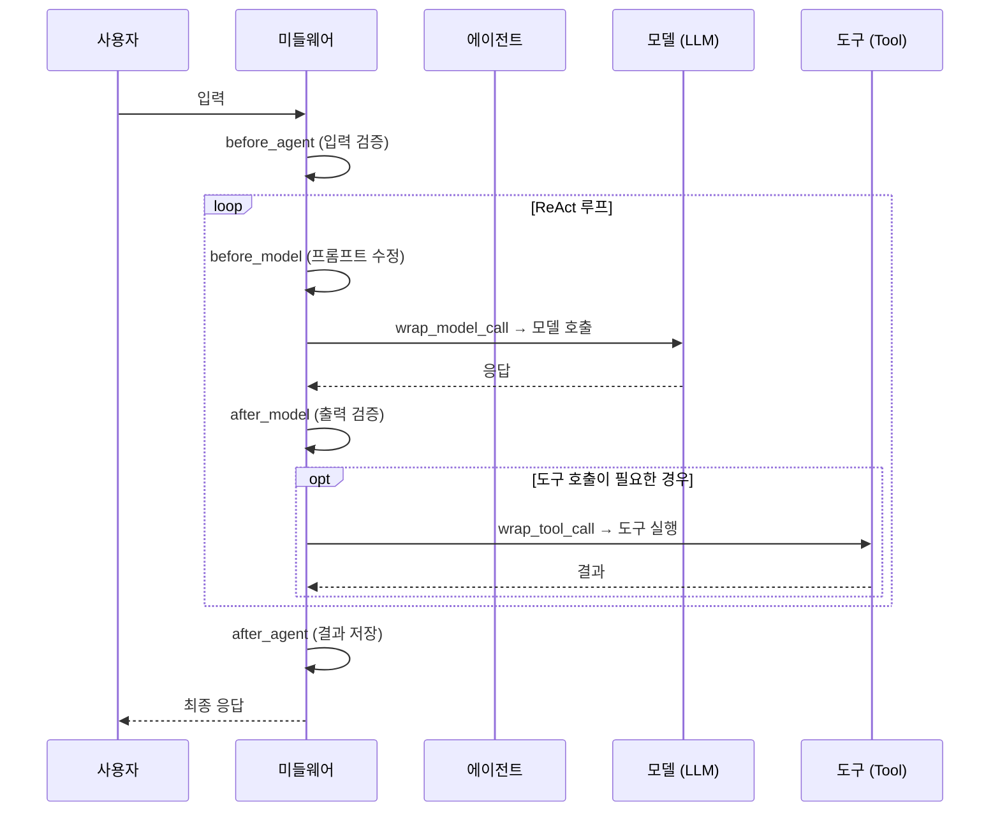
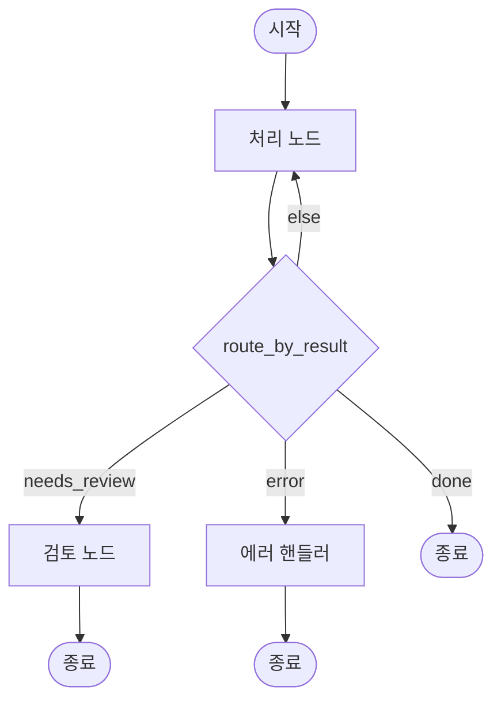
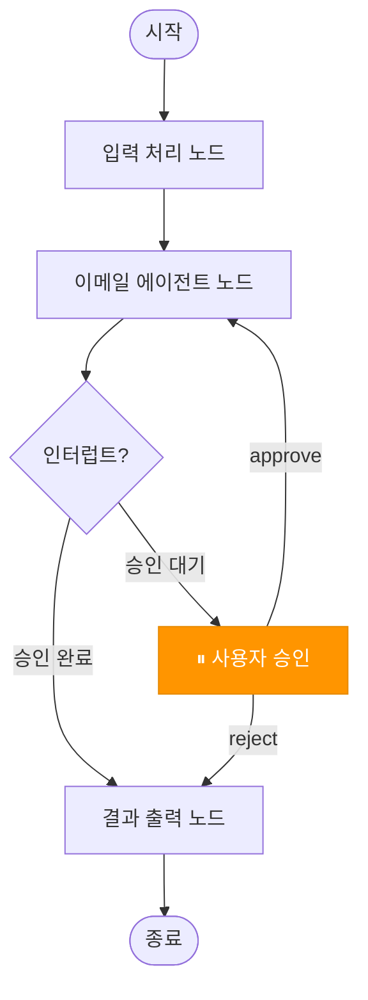

# 3주차: 미들웨어와 제어 흐름 (Middleware & Control Flow)

> **목표**: Act Operator의 강점인 미들웨어 시스템을 적용하여 에이전트의 안정성과 제어권을 확보합니다.

---

## 📋 학습 체크리스트

- [ ] Step 1: 미들웨어 시스템 개요
- [ ] Step 2: 미들웨어 훅(Hook) 타입 이해
- [ ] Step 3: Human-in-the-Loop — 사용자 승인 미들웨어
- [ ] Step 4: SummarizationMiddleware — 대화 요약
- [ ] Step 5: PIIMiddleware — 개인정보 보호
- [ ] Step 6: 커스텀 미들웨어 작성법
- [ ] Step 7: 조건부 분기 (`conditions.py`)
- [ ] Step 8: 체크포인터 — 상태 저장 (Persistence)
- [ ] Step 9: 미들웨어 안정성 패턴 (Retry, Fallback)
- [ ] Step 10: 실습 과제 — 이메일 봇 + HITL + 요약
- [ ] 마무리: 복습 퀴즈

---

## Step 1: 미들웨어 시스템 개요

### 1.1 미들웨어란?

미들웨어(Middleware)는 에이전트의 **실행 흐름 중간에 끼어들어** 추가 로직을 수행하는 컴포넌트입니다. 코드를 직접 수정하지 않고도 안전장치, 모니터링, 변환 등을 추가할 수 있습니다.

```
사용자 입력
    ↓
┌──────────────────────────────────┐
│  🛡️ 미들웨어 레이어               │
│  ┌────────────────────────────┐  │
│  │ before_agent (입력 검증)    │  │
│  │ before_model (프롬프트 수정) │  │
│  │ wrap_model_call (재시도)    │  │
│  │ wrap_tool_call (승인)      │  │
│  │ after_model (출력 검증)    │  │
│  │ after_agent (결과 저장)    │  │
│  └────────────────────────────┘  │
└──────────────────────────────────┘
    ↓
최종 응답
```

### 1.2 미들웨어의 3가지 카테고리

| 카테고리 | 내장 미들웨어 | 목적 |
|:---:|:---:|---|
| **안전성** | `HumanInTheLoopMiddleware`, `PIIMiddleware` | 승인, 개인정보 보호 |
| **안정성** | `ModelRetryMiddleware`, `ModelFallbackMiddleware` | 재시도, 대체 모델 |
| **컨텍스트** | `SummarizationMiddleware` | 대화 요약, 토큰 절약 |

### 1.3 미들웨어를 에이전트에 등록하는 방법

```python
# casts/{cast_name}/modules/agents.py
from langchain.agents import create_agent
from .middlewares import get_hitl_middleware, get_pii_middleware

def set_safe_agent():
    return create_agent(
        model=get_model(),
        tools=[...],
        middleware=[                    # ← 여기에 리스트로 전달!
            get_hitl_middleware(),
            get_pii_middleware(),
        ],
    )
```

---

## Step 2: 미들웨어 훅(Hook) 타입 이해

### 2.1 두 종류의 훅

| 종류 | 훅 이름 | 동작 방식 |
|:---:|:---:|---|
| **Node-style** | `before_agent`, `before_model`, `after_model`, `after_agent` | 특정 시점에 **순차 실행** |
| **Wrap-style** | `wrap_model_call`, `wrap_tool_call` | 호출을 **감싸서** 앞뒤에서 제어 |

### 2.2 실행 흐름 다이어그램



### 2.3 실행 순서 규칙

미들웨어가 여러 개일 때:

```python
middleware = [middleware1, middleware2, middleware3]
```

| 페이즈 | 순서 | 설명 |
|:---:|:---:|---|
| `before_*` 훅 | 1 → 2 → 3 | **순방향** (첫 번째부터) |
| `wrap_*` 훅 | 1 ▸ 2 ▸ 3 ▸ 실제호출 | **양파 껍질** (1이 2를 감싸고, 2가 3을 감쌈) |
| `after_*` 훅 | 3 → 2 → 1 | **역방향** (마지막부터) |

> [!TIP]
> **가장 중요한 미들웨어를 리스트의 앞에** 배치하세요. `before_*`에서 먼저 검증하고, `after_*`에서 마지막으로 최종 확인할 수 있습니다.

---

## Step 3: Human-in-the-Loop — 사용자 승인 미들웨어

### 3.1 HumanInTheLoopMiddleware란?

민감한 도구(이메일 전송, DB 수정 등)를 실행하기 전에 **사용자 승인을 요청**하고, 승인 없이는 실행하지 않는 미들웨어입니다.

### 3.2 기본 사용법

```python
# casts/{cast_name}/modules/middlewares.py
from langchain.agents.middleware import HumanInTheLoopMiddleware


def get_hitl_middleware():
    return HumanInTheLoopMiddleware(
        interrupt_on={
            "send_email": True,                                    # 모든 결정 허용
            "execute_sql": {"allowed_decisions": ["approve", "reject"]},  # 수정 불가
            "read_data": False,                                    # 자동 승인 (중단 안 함)
        },
        description_prefix="도구 실행 승인 대기 중",
    )
```

### 3.3 `interrupt_on` 설정

| 설정 | 의미 |
|:---:|---|
| `"send_email": True` | send_email 호출 시 **중단**, 승인/수정/거부 모두 가능 |
| `"execute_sql": {"allowed_decisions": ["approve", "reject"]}` | 중단, **승인 또는 거부만** 가능 (수정 불가) |
| `"read_data": False` | 중단 **없이** 자동 실행 |

### 3.4 사용자 결정 유형 (Decision Types)

| 결정 | 설명 | 사용 시나리오 |
|:---:|---|---|
| `approve` | 도구를 그대로 실행 | "이 이메일 보내겠습니다" → "네" |
| `edit` | 인자를 수정 후 실행 | 수신자 이메일 주소를 변경 |
| `reject` | 실행을 거부하고 피드백 전달 | "이 내용은 보내면 안 됩니다" |

### 3.5 에이전트에 등록

```python
# casts/{cast_name}/modules/agents.py
from langchain.agents import create_agent
from langgraph.checkpoint.memory import InMemorySaver
from .middlewares import get_hitl_middleware


def set_hitl_agent():
    return create_agent(
        model=get_model(),
        tools=[send_email, read_data],
        middleware=[get_hitl_middleware()],
        checkpointer=InMemorySaver(),     # ⚠️ HITL에는 체크포인터 필수!
    )
```

> [!WARNING]
> Human-in-the-Loop은 반드시 **체크포인터(Checkpointer)**와 함께 사용해야 합니다. 중단된 시점의 상태를 저장해야 재개(resume)가 가능합니다.

### 3.6 중단 후 재개 (Command)

```python
from langgraph.types import Command

# ✅ 승인 — 도구를 그대로 실행
agent.invoke(
    Command(resume={"decisions": [{"type": "approve"}]}),
    config=config
)

# ✏️ 수정 — 인자를 변경 후 실행
agent.invoke(
    Command(resume={"decisions": [{
        "type": "edit",
        "edited_action": {"name": "send_email", "args": {"to": "new@email.com"}}
    }]}),
    config=config
)

# ❌ 거부 — 실행 취소 + 피드백
agent.invoke(
    Command(resume={"decisions": [{"type": "reject", "message": "수신자가 잘못되었습니다"}]}),
    config=config
)
```

### 3.7 노드에서 HITL 처리

```python
# casts/{cast_name}/modules/nodes.py
from casts.base_node import BaseNode
from .agents import set_hitl_agent


class EmailNode(BaseNode):
    def __init__(self):
        super().__init__()
        self.agent = set_hitl_agent()

    def execute(self, state, config):
        thread_id = self.get_thread_id(config) or "default"
        agent_config = {"configurable": {"thread_id": thread_id}}

        result = self.agent.invoke(
            {"messages": [{"role": "user", "content": state["query"]}]},
            config=agent_config
        )

        # 인터럽트 발생 여부 확인
        if "__interrupt__" in result:
            return {"interrupt": result["__interrupt__"]}

        return {"messages": result["messages"]}
```

---

## Step 4: SummarizationMiddleware — 대화 요약

### 4.1 왜 필요한가?

LLM에는 **컨텍스트 윈도우 제한**이 있습니다. 대화가 길어지면 토큰 한계에 도달하여 오류가 발생합니다. SummarizationMiddleware는 대화가 길어질 때 자동으로 이전 내용을 **요약하여 압축**합니다.

```
[메시지 1] [메시지 2] ... [메시지 50] [메시지 51] ...
           ↓ 토큰 한계에 가까워지면
[요약: "이전 대화에서는 X, Y, Z를 논의했습니다"] [메시지 45] ... [메시지 51]
```

### 4.2 기본 사용법

```python
# casts/{cast_name}/modules/middlewares.py
from langchain.agents.middleware import SummarizationMiddleware


def get_summarization_middleware():
    return SummarizationMiddleware(
        model="gpt-4o-mini",           # 요약에 사용할 모델 (저비용 권장)
        trigger={"tokens": 4000},       # 트리거 조건: 4000토큰 초과 시
        keep={"messages": 20},          # 최근 20개 메시지는 보존
    )
```

### 4.3 트리거 조건 (trigger)

| 설정 | 의미 |
|---|---|
| `{"tokens": 4000}` | 총 토큰이 4000 이상이면 요약 |
| `{"messages": 10}` | 메시지가 10개 이상이면 요약 |
| `{"tokens": 4000, "messages": 10}` | 토큰 4000 **AND** 메시지 10개 이상 |
| `{"fraction": 0.8}` | 모델 컨텍스트의 80% 사용 시 요약 |
| `[{"tokens": 5000, "messages": 3}, {"tokens": 3000, "messages": 6}]` | 조건 A **OR** 조건 B |

### 4.4 보존 조건 (keep)

| 설정 | 의미 |
|---|---|
| `{"messages": 20}` | 최근 20개 메시지 보존 |
| `{"tokens": 2000}` | 최근 ~2000토큰 보존 |
| `{"fraction": 0.3}` | 컨텍스트의 30% 보존 |

### 4.5 에이전트에 등록

```python
# casts/{cast_name}/modules/agents.py
from langchain.agents import create_agent
from .middlewares import get_summarization_middleware

def set_summarizing_agent():
    return create_agent(
        model=get_model(),
        tools=[...],
        middleware=[get_summarization_middleware()],
    )
```

---

## Step 5: PIIMiddleware — 개인정보 보호

### 5.1 PIIMiddleware란?

PII(Personally Identifiable Information)를 자동으로 **감지하고 가림 처리**하는 미들웨어입니다. 이메일, 신용카드, IP 주소 등을 보호합니다.

### 5.2 기본 사용법

```python
# casts/{cast_name}/modules/middlewares.py
from langchain.agents.middleware import PIIMiddleware


def get_pii_middlewares():
    return [
        PIIMiddleware("email", strategy="redact", apply_to_input=True),
        PIIMiddleware("credit_card", strategy="mask", apply_to_input=True),
        PIIMiddleware(
            "api_key",
            detector=r"sk-[a-zA-Z0-9]{32}",    # 커스텀 정규식
            strategy="block",                     # 차단 (에러 발생)
            apply_to_input=True,
        ),
    ]
```

### 5.3 전략 (Strategy)

| 전략 | 동작 | 예시 |
|:---:|---|---|
| `redact` | 타입 표시로 대체 | `user@email.com` → `[REDACTED_EMAIL]` |
| `mask` | 일부만 마스킹 | `1234-5678-9012-3456` → `****3456` |
| `hash` | 결정론적 해시값 | `user@email.com` → `a1b2c3d4...` |
| `block` | 에러를 발생시켜 차단 | 처리 자체를 중단 |

### 5.4 내장 PII 타입

| 타입 | 감지 대상 |
|:---:|---|
| `email` | 이메일 주소 |
| `credit_card` | 신용카드 번호 |
| `ip` | IP 주소 |
| `mac_address` | MAC 주소 |
| `url` | URL |

### 5.5 적용 범위

| 파라미터 | 기본값 | 설명 |
|:---:|:---:|---|
| `apply_to_input` | `True` | 사용자 입력에 적용 |
| `apply_to_output` | `False` | 모델 출력에 적용 |
| `apply_to_tool_results` | `False` | 도구 실행 결과에 적용 |

---

## Step 6: 커스텀 미들웨어 작성법

### 6.1 AgentMiddleware 클래스 상속

내장 미들웨어로 충분하지 않을 때, 직접 커스텀 미들웨어를 작성합니다:

```python
# casts/{cast_name}/modules/middlewares.py
from typing import Any, Callable
from langchain.agents.middleware import (
    AgentMiddleware, AgentState, ModelRequest, ModelResponse, hook_config
)
from langgraph.runtime import Runtime


class CustomMiddleware(AgentMiddleware):
    def __init__(self, config_value: int = 10):
        super().__init__()
        self.config_value = config_value

    # ── Node-style 훅 ──
    def before_agent(self, state: AgentState, runtime: Runtime) -> dict[str, Any] | None:
        """에이전트 시작 전 1회 실행. 입력 검증에 유리."""
        return None    # None 반환 = 상태 변경 없음

    def before_model(self, state: AgentState, runtime: Runtime) -> dict[str, Any] | None:
        """각 모델 호출 전 실행."""
        return None

    def after_model(self, state: AgentState, runtime: Runtime) -> dict[str, Any] | None:
        """각 모델 응답 후 실행."""
        return None

    def after_agent(self, state: AgentState, runtime: Runtime) -> dict[str, Any] | None:
        """에이전트 완료 후 1회 실행. 결과 저장에 유리."""
        return None

    # ── Wrap-style 훅 ──
    def wrap_model_call(self, request: ModelRequest, handler) -> ModelResponse:
        """모델 호출을 감싸서 앞뒤에서 제어."""
        return handler(request)    # handler 호출 = 실제 모델 실행

    def wrap_tool_call(self, request, handler):
        """도구 호출을 감싸서 앞뒤에서 제어."""
        return handler(request)
```

### 6.2 Agent Jump — 조기 종료

특정 조건에서 에이전트를 즉시 종료시킬 수 있습니다:

```python
from langchain.agents.middleware import AgentMiddleware, AgentState, hook_config
from langchain.messages import AIMessage


class MessageLimitMiddleware(AgentMiddleware):
    def __init__(self, max_messages: int = 50):
        super().__init__()
        self.max_messages = max_messages

    @hook_config(can_jump_to=["end"])   # ← 점프 가능 대상 선언 필수!
    def before_model(self, state: AgentState, runtime) -> dict | None:
        if len(state["messages"]) >= self.max_messages:
            return {
                "messages": [AIMessage("대화 한도에 도달했습니다.")],
                "jump_to": "end"     # ← 에이전트 즉시 종료
            }
        return None
```

**점프 대상**:

| 대상 | 설명 |
|:---:|---|
| `"end"` | 에이전트 실행 종료 |
| `"tools"` | 도구 노드로 점프 |
| `"model"` | 모델 노드로 점프 |

### 6.3 커스텀 State 확장

미들웨어 전용 상태 필드를 추가할 수 있습니다:

```python
from typing_extensions import NotRequired
from langchain.agents.middleware import AgentMiddleware, AgentState


class CustomState(AgentState):
    model_call_count: NotRequired[int]    # 미들웨어 전용 필드


class CallCounterMiddleware(AgentMiddleware[CustomState]):
    state_schema = CustomState

    def after_model(self, state: CustomState, runtime) -> dict | None:
        return {"model_call_count": state.get("model_call_count", 0) + 1}
```

> [!TIP]
> `NotRequired`를 사용하면 에이전트 호출 시 해당 필드를 생략해도 됩니다. 미들웨어 내부에서만 사용하는 필드에 유용합니다.

---

## Step 7: 조건부 분기 (`conditions.py`)

### 7.1 조건부 분기란?

노드의 실행 결과에 따라 **다음에 어떤 노드로 이동할지** 결정하는 로직입니다.

### 7.2 `conditions.py`에 라우팅 함수 정의

```python
# casts/{cast_name}/modules/conditions.py
from langgraph.graph import END


def route_by_result(state) -> str:
    """결과 상태에 따라 다음 노드를 결정합니다."""
    if state.get("error"):
        return "error_handler"
    if state.get("needs_review"):
        return "review_node"
    if state.get("done"):
        return END                 # END도 반환 가능
    return "process_node"
```

### 7.3 `graph.py`에서 조건부 엣지 등록

```python
# casts/{cast_name}/graph.py
from casts.{cast_name}.modules.conditions import route_by_result


class MyGraph(BaseGraph):
    def build(self):
        builder = StateGraph(State)
        
        builder.add_node("process", ProcessNode())
        builder.add_node("review_node", ReviewNode())
        builder.add_node("error_handler", ErrorNode())

        # 조건부 엣지 등록
        builder.add_conditional_edges(
            "process",              # 출발 노드
            route_by_result,        # 라우팅 함수
            {                        # 반환값 → 노드 매핑
                "review_node": "review_node",
                "error_handler": "error_handler",
                "process_node": "process",
                END: END,
            }
        )
        # ...
```

### 7.4 조건부 시작점 (Conditional Entry Point)

그래프의 시작부터 분기할 수도 있습니다:

```python
from langgraph.graph import START

builder.add_conditional_edges(
    START,                         # 시작점에서 분기!
    route_by_input_type,
    {"text": "text_handler", "image": "image_handler"}
)
```

### 7.5 시각화 예시



---

## Step 8: 체크포인터 — 상태 저장 (Persistence)

### 8.1 왜 체크포인터가 필요한가?

- **Human-in-the-Loop**: 중단된 시점의 상태를 저장/복원
- **대화 지속**: 서버 재시작 후에도 대화 흐름 유지
- **타임 트래블**: 이전 상태로 되돌아가기

### 8.2 체크포인터 종류

| 체크포인터 | 패키지 | 용도 |
|:---:|:---:|---|
| `MemorySaver` | `langgraph` (내장) | 개발/테스트용 (메모리, 휘발성) |
| `SqliteSaver` | `langgraph-checkpoint-sqlite` | 로컬 파일 저장 |
| `PostgresSaver` | `langgraph-checkpoint-postgres` | 프로덕션 DB 저장 |

### 8.3 그래프에 체크포인터 적용

```python
# casts/{cast_name}/graph.py
from langgraph.checkpoint.memory import MemorySaver


class MyGraph(BaseGraph):
    def __init__(self, checkpointer=None):
        super().__init__()
        self.checkpointer = checkpointer or MemorySaver()

    def build(self):
        builder = StateGraph(State)
        # ... 노드, 엣지 등록 ...

        graph = builder.compile(
            checkpointer=self.checkpointer    # ← 체크포인터 전달
        )
        graph.name = self.name
        return graph
```

### 8.4 인터럽트 (Interrupt)와 함께 사용

특정 노드 전/후에 실행을 일시 중단합니다:

```python
graph = builder.compile(
    checkpointer=MemorySaver(),              # 필수!
    interrupt_before=["approval_node"],       # 이 노드 실행 전 중단
    # 또는
    interrupt_after=["data_fetch_node"],      # 이 노드 실행 후 중단
)
```

### 8.5 결정 프레임워크

```
실행 사이에 상태를 저장해야 하나요?
├─ Yes → 체크포인터 추가
│   ├─ 개발용 → MemorySaver()
│   └─ 프로덕션 → SqliteSaver / PostgresSaver
└─ No → compile()만 사용

사용자 승인이 필요한가요?
└─ Yes → interrupt_before/after 추가
         ⚠️ 체크포인터 필수!
```

---

## Step 9: 미들웨어 안정성 패턴 (Retry, Fallback)

### 9.1 ModelRetryMiddleware — 자동 재시도

LLM 호출이 간헐적으로 실패할 때 **지수 백오프(Exponential Backoff)**로 재시도합니다:

```python
# casts/{cast_name}/modules/middlewares.py
from langchain.agents.middleware import ModelRetryMiddleware


def get_retry_middleware():
    return ModelRetryMiddleware(
        max_retries=3,          # 최대 3회 재시도
        backoff_factor=2.0,     # 대기 시간 2배씩 증가
        initial_delay=1.0,      # 첫 재시도 1초 대기
        max_delay=60.0,         # 최대 60초까지
        jitter=True,            # ±25% 랜덤 변동 추가
    )
```

**재시도 타이밍 예시**: 1초 → 2초 → 4초 (±jitter)

### 9.2 커스텀 예외 필터

특정 에러에 대해서만 재시도:

```python
def should_retry(error: Exception) -> bool:
    if hasattr(error, "status_code"):
        return error.status_code in (429, 503)   # Rate Limit, Service Unavailable만
    return False

def get_selective_retry():
    return ModelRetryMiddleware(
        max_retries=4,
        retry_on=should_retry,
        on_failure="error",     # 재시도 소진 시 에러 발생 ("continue" = 무시)
    )
```

### 9.3 ModelFallbackMiddleware — 대체 모델

주 모델이 실패할 때 자동으로 대체 모델로 전환:

```python
from langchain.agents.middleware import ModelFallbackMiddleware


def get_fallback_middleware():
    return ModelFallbackMiddleware(
        "gpt-4o-mini",                    # 1차 대체
        "claude-3-5-sonnet-20241022",     # 2차 대체
    )
```

### 9.4 미들웨어 조합 — 프로덕션 레시피

```python
def set_production_agent():
    return create_agent(
        model=get_model(),
        tools=[...],
        middleware=[
            # 1. 입력 보호 (가장 먼저)
            PIIMiddleware("email", strategy="redact", apply_to_input=True),
            # 2. 재시도 + 폴백 (안정성)
            get_retry_middleware(),
            get_fallback_middleware(),
            # 3. 승인 절차
            get_hitl_middleware(),
            # 4. 대화 요약 (토큰 관리)
            get_summarization_middleware(),
        ],
        checkpointer=InMemorySaver(),
    )
```

---

## Step 10: 실습 과제 — 이메일 봇 + HITL + 요약

### 10.1 과제 목표

| 항목 | 내용 |
|:---:|---|
| **Cast 이름** | `email_assistant` |
| **기능** | 이메일 초안 작성 → 사용자 승인 → 전송 |
| **미들웨어** | HITL (승인), Summarization (요약), PII (개인정보 보호) |

### 10.2 아키텍처 다이어그램



### 10.3 구현 파일

#### 📄 A. `middlewares.py`

```python
# casts/email_assistant/modules/middlewares.py
from langchain.agents.middleware import (
    HumanInTheLoopMiddleware,
    SummarizationMiddleware,
    PIIMiddleware,
)


def get_email_hitl_middleware():
    """이메일 전송 도구에 대해 사용자 승인을 요청합니다."""
    return HumanInTheLoopMiddleware(
        interrupt_on={
            "send_email": True,         # 이메일 전송 시 승인 필요
            "draft_email": False,        # 초안 작성은 자동 실행
        },
        description_prefix="이메일 전송 승인 대기 중",
    )


def get_email_summarization_middleware():
    """대화가 길어지면 자동으로 요약합니다."""
    return SummarizationMiddleware(
        model="gpt-4o-mini",
        trigger={"tokens": 3000, "messages": 10},
        keep={"messages": 5},
    )


def get_email_pii_middlewares():
    """이메일 내용에서 민감 정보를 가림 처리합니다."""
    return [
        PIIMiddleware("email", strategy="redact", apply_to_output=True),
        PIIMiddleware("credit_card", strategy="mask", apply_to_output=True),
    ]
```

#### 📄 B. `tools.py`

```python
# casts/email_assistant/modules/tools.py
from langchain.tools import tool


@tool
def draft_email(to: str, subject: str, body: str) -> str:
    """이메일 초안을 작성합니다.

    Args:
        to: 수신자 이메일 주소
        subject: 이메일 제목
        body: 이메일 본문
    """
    return f"초안 작성 완료 — 수신: {to}, 제목: {subject}"


@tool
def send_email(to: str, subject: str, body: str) -> str:
    """이메일을 실제로 전송합니다. (HITL 승인 필요)

    Args:
        to: 수신자 이메일 주소
        subject: 이메일 제목
        body: 이메일 본문
    """
    # 실제 구현에서는 SMTP 등으로 전송
    return f"이메일 전송 완료 — 수신: {to}, 제목: {subject}"
```

#### 📄 C. `agents.py`

```python
# casts/email_assistant/modules/agents.py
from langchain.agents import create_agent
from langgraph.checkpoint.memory import InMemorySaver
from .models import get_chat_model
from .tools import draft_email, send_email
from .middlewares import (
    get_email_hitl_middleware,
    get_email_summarization_middleware,
    get_email_pii_middlewares,
)


def set_email_agent():
    return create_agent(
        model=get_chat_model(),
        tools=[draft_email, send_email],
        middleware=[
            *get_email_pii_middlewares(),           # PII 보호
            get_email_hitl_middleware(),             # 승인 절차
            get_email_summarization_middleware(),    # 대화 요약
        ],
        system_prompt="이메일 작성과 전송을 돕는 어시스턴트입니다.",
        checkpointer=InMemorySaver(),
    )
```

#### 📄 D. `conditions.py`

```python
# casts/email_assistant/modules/conditions.py
from langgraph.graph import END


def check_interrupt(state) -> str:
    """인터럽트 발생 여부에 따라 분기합니다."""
    if state.get("interrupt"):
        return "wait_approval"
    return "output"
```

### 10.4 과제 제출 체크리스트

- [ ] `HumanInTheLoopMiddleware`가 `send_email` 도구에 대해 승인을 요청하는가?
- [ ] `SummarizationMiddleware`가 토큰 한계 시 자동 요약하도록 설정되었는가?
- [ ] `PIIMiddleware`가 출력에서 이메일/카드번호를 가림 처리하는가?
- [ ] 체크포인터(`InMemorySaver`)가 에이전트에 설정되었는가?
- [ ] `conditions.py`에 분기 로직이 정의되었는가?
- [ ] 미들웨어를 `create_agent`의 `middleware` 파라미터에 등록했는가?

---

## 🧠 복습 퀴즈

### Q1. 미들웨어 훅 실행 순서

`middleware=[A, B, C]`일 때, `before_model`과 `after_model`의 실행 순서를 각각 적으세요.

<details>
<summary>정답</summary>

- `before_model`: **A → B → C** (순방향)
- `after_model`: **C → B → A** (역방향)

`wrap_*` 훅은 양파 껍질 구조: A가 B를 감싸고, B가 C를 감싸고, C가 실제 호출을 감쌉니다.
</details>

### Q2. HITL 필수 요소

Human-in-the-Loop 미들웨어를 사용할 때 반드시 함께 설정해야 하는 것은?

<details>
<summary>정답</summary>

**Checkpointer** (예: `InMemorySaver()`)

중단된 시점의 상태를 저장해야 재개(resume)가 가능하기 때문입니다. 체크포인터 없이 인터럽트를 사용하면 에러가 발생합니다.
</details>

### Q3. PII 전략 매칭

다음 각 상황에 적합한 PII 전략을 연결하세요:

| 상황 | 전략 |
|---|:---:|
| 이메일 주소를 `[REDACTED_EMAIL]`로 대체 | ? |
| 카드번호 끝 4자리만 남기고 마스킹 | ? |
| API 키가 감지되면 처리 자체를 차단 | ? |

<details>
<summary>정답</summary>

| 상황 | 전략 |
|---|:---:|
| 이메일 주소를 `[REDACTED_EMAIL]`로 대체 | `redact` |
| 카드번호 끝 4자리만 남기고 마스킹 | `mask` |
| API 키가 감지되면 처리 자체를 차단 | `block` |
</details>

### Q4. 커스텀 미들웨어

에이전트가 50개 이상의 메시지를 생성하면 즉시 종료시키려면, 어떤 데코레이터를 `before_model` 훅에 추가해야 하나요?

<details>
<summary>정답</summary>

```python
@hook_config(can_jump_to=["end"])
```

`jump_to` 반환값을 사용하려면 반드시 `@hook_config(can_jump_to=[...])`로 점프 가능 대상을 사전에 선언해야 합니다.
</details>

---

## 📚 참고 자료

- [Human-in-the-Loop 패턴](../.claude/skills/developing-cast/resources/middlewares/provider-agnostic/human-in-the-loop.md)
- [Summarization 패턴](../.claude/skills/developing-cast/resources/middlewares/provider-agnostic/summarization.md)
- [Guardrails (PII) 패턴](../.claude/skills/developing-cast/resources/middlewares/provider-agnostic/guardrails.md)
- [Custom Middleware 작성법](../.claude/skills/developing-cast/resources/middlewares/custom.md)
- [LangChain Middleware 공식 문서](https://docs.langchain.com/oss/python/langchain/middleware/built-in)
- [LangGraph Persistence 문서](https://docs.langchain.com/oss/python/langgraph/graph-api#persistence)

---

## 다음 주차 예고

> **4주차: 엔지니어링 및 운영 최적화**에서는 `engineering-act` 스킬로 모노레포 내 여러 Cast의 의존성을 관리하고, `testing-cast` 스킬로 pytest 기반 테스트를 자동 생성하며, LangSmith를 통한 관측 가능성을 확보합니다.
