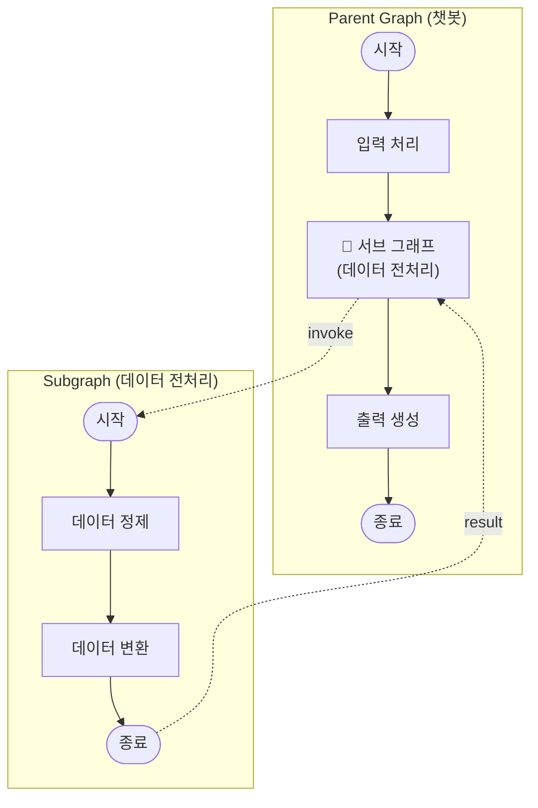

# 4주차: 엔지니어링 및 운영 최적화 (Engineering & Operations)

> **목표**: 다중 Cast 관리, 테스트 코드 작성, 그리고 LangSmith를 통한 관측 가능성을 확보합니다.

---

## 📋 학습 체크리스트

- [ ] Step 1: 모노레포 구조와 다중 Cast 관리
- [ ] Step 2: 새로운 Cast 추가 (`uv run act cast`)
- [ ] Step 3: 의존성 관리 (`pyproject.toml`)
- [ ] Step 4: 서브 그래프 (Subgraph) 연결
- [ ] Step 5: `testing-cast` 스킬 개요
- [ ] Step 6: 노드 테스트 작성
- [ ] Step 7: 그래프 테스트 작성
- [ ] Step 8: Mocking 전략
- [ ] Step 9: Fixture와 커버리지
- [ ] Step 10: LangSmith — 관측 가능성 (Observability)
- [ ] Step 11: 실습 과제 — 데이터 전처리 Cast + 서브 그래프 + 테스트
- [ ] 마무리: 복습 퀴즈

---

## Step 1: 모노레포 구조와 다중 Cast 관리

### 1.1 Act는 모노레포(Monorepo)

1주차에서 배운 것처럼 **Act는 여러 Cast를 포함하는 모노레포**입니다. 각 Cast는 독립적인 워크플로우이며, 자체 의존성을 가집니다.

```
my-act/                            # Act (모노레포)
├── pyproject.toml                  # Act 전체 의존성
├── .env                            # 환경 변수
├── langgraph.json                  # 그래프 등록
├── casts/
│   ├── chatbot/                    # Cast 1: 챗봇
│   │   ├── pyproject.toml          # chatbot 전용 의존성
│   │   ├── graph.py
│   │   └── modules/
│   │       ├── state.py
│   │       ├── nodes.py
│   │       ├── tools.py
│   │       └── ...
│   ├── data_preprocessor/          # Cast 2: 데이터 전처리
│   │   ├── pyproject.toml          # data_preprocessor 전용 의존성
│   │   ├── graph.py
│   │   └── modules/
│   │       └── ...
│   └── report_generator/           # Cast 3: 보고서 생성
│       ├── pyproject.toml
│       ├── graph.py
│       └── modules/
│           └── ...
└── tests/
    ├── conftest.py
    ├── test_chatbot.py
    └── test_data_preprocessor.py
```

### 1.2 왜 여러 Cast를 분리하는가?

| 장점 | 설명 |
|:---:|---|
| **독립 의존성** | 각 Cast가 필요한 패키지만 설치 |
| **독립 배포** | Cast 단위로 개별 배포 가능 |
| **분업 개발** | 팀원별로 다른 Cast 담당 |
| **재사용성** | 한 Cast를 다른 Act에서도 사용 가능 |

---

## Step 2: 새로운 Cast 추가 (`uv run act cast`)

### 2.1 Cast 추가 명령어

```bash
# Act 프로젝트 디렉토리 안에서 실행
uv run act cast
```

이 명령을 실행하면 대화식으로 Cast 이름을 입력받고, 자동으로 다음을 생성합니다:

```
casts/{cast_name}/
├── pyproject.toml
├── graph.py
├── CLAUDE.md
└── modules/
    ├── __init__.py
    ├── state.py
    ├── nodes.py
    ├── tools.py
    ├── agents.py
    ├── models.py
    ├── prompts.py
    ├── conditions.py
    └── middlewares.py
```

### 2.2 Cast 이름과 옵션

```bash
# 이름을 직접 지정하여 비대화식으로 생성
uv run act cast --cast-name "Data Preprocessor"

# 언어 지정 (한국어)
uv run act cast --cast-name "Data Preprocessor" --lang ko
```

### 2.3 Cast 추가 후 해야 할 일

```bash
# 1. 의존성 동기화
uv sync

# 2. langgraph.json에 새 Cast의 그래프 등록 확인
# 3. 새 Cast의 CLAUDE.md에 아키텍처 명세 작성 (architecting-act 스킬로)
```

---

## Step 3: 의존성 관리 (`pyproject.toml`)

### 3.1 의존성 계층 구조

모노레포에서는 **두 단계의 의존성**을 관리합니다:

```
my-act/pyproject.toml             ← Act 공통 의존성 (langgraph, langchain 등)
├── casts/chatbot/pyproject.toml   ← chatbot 전용 (langchain-openai 등)
├── casts/data_preprocessor/pyproject.toml   ← data_preprocessor 전용 (pandas 등)
└── casts/report_generator/pyproject.toml    ← report_generator 전용
```

### 3.2 Cast별 의존성 추가

```bash
# 특정 Cast에 패키지 추가
uv add --package chatbot langchain-openai
uv add --package data_preprocessor pandas numpy

# 개발 의존성 추가
uv add --dev pytest pytest-asyncio pytest-cov
```

### 3.3 Cast별 `pyproject.toml` 예시

```toml
# casts/data_preprocessor/pyproject.toml
[project]
name = "data-preprocessor"
version = "0.1.0"
requires-python = ">=3.11"
dependencies = [
    "pandas>=2.0",
    "numpy>=1.24",
]
```

### 3.4 의존성 충돌 방지

> [!WARNING]
> 각 Cast는 독립적인 `pyproject.toml`을 가지므로, Cast 간에 **같은 패키지의 다른 버전**을 사용할 수 있습니다. 하지만 uv workspace에서는 동일 패키지의 버전 충돌에 주의해야 합니다.

```bash
# 의존성 동기화 (충돌 검사 포함)
uv sync

# 잠금 파일 갱신
uv lock
```

---

## Step 4: 서브 그래프 (Subgraph) 연결

### 4.1 서브 그래프란?

서브 그래프는 **하나의 그래프를 다른 그래프의 노드로 사용**하는 패턴입니다. 다중 Cast를 연결하거나 재사용 가능한 워크플로우를 만들 때 사용합니다.



### 4.2 연결 방법 1: 노드에서 호출 (다른 State 스키마)

부모와 서브 그래프의 **State가 다를 때** 사용합니다:

```python
# casts/{cast_name}/modules/nodes.py
from casts.base_node import BaseNode
from .subgraphs import preprocessing_subgraph


class PreprocessingNode(BaseNode):
    def __init__(self):
        super().__init__()
        self.subgraph = preprocessing_subgraph

    def execute(self, state):
        # 1️⃣ 부모 State → 서브 그래프 입력으로 변환
        subgraph_input = {"raw_data": state["user_input"]}
        
        # 2️⃣ 서브 그래프 호출
        subgraph_output = self.subgraph.invoke(subgraph_input)
        
        # 3️⃣ 서브 그래프 출력 → 부모 State로 변환
        return {"processed_data": subgraph_output["result"]}
```

### 4.3 서브 그래프 정의

```python
# casts/{cast_name}/modules/subgraphs.py
from typing_extensions import TypedDict
from langgraph.graph import StateGraph, START, END


class PreprocessState(TypedDict):
    raw_data: str
    result: str


def clean_data(state: PreprocessState):
    cleaned = state["raw_data"].strip().lower()
    return {"result": cleaned}


def transform_data(state: PreprocessState):
    transformed = state["result"].replace(" ", "_")
    return {"result": f"processed: {transformed}"}


# 서브 그래프 빌드
builder = StateGraph(PreprocessState)
builder.add_node("clean", clean_data)
builder.add_node("transform", transform_data)
builder.add_edge(START, "clean")
builder.add_edge("clean", "transform")
builder.add_edge("transform", END)

preprocessing_subgraph = builder.compile()
```

### 4.4 연결 방법 2: 노드로 직접 등록 (같은 State 키 공유)

부모와 서브 그래프가 **같은 State 키를 공유**할 때:

```python
# casts/{cast_name}/graph.py
from casts.{cast_name}.modules.subgraphs import shared_subgraph


class ParentGraph(BaseGraph):
    def build(self):
        builder = StateGraph(State)
        
        builder.add_node("preprocess", PreprocessNode())
        builder.add_node("subgraph", shared_subgraph)   # 컴파일된 그래프를 직접 등록!
        builder.add_node("postprocess", PostprocessNode())
        
        builder.add_edge(START, "preprocess")
        builder.add_edge("preprocess", "subgraph")
        builder.add_edge("subgraph", "postprocess")
        builder.add_edge("postprocess", END)
        
        graph = builder.compile()
        graph.name = self.name
        return graph
```

### 4.5 선택 기준

```
부모와 서브 그래프가 State 키를 공유하나요?
├─ Yes → builder.add_node("name", subgraph)  # 직접 등록
└─ No  → 노드 안에서 invoke하고 State 변환     # 노드에서 호출
```

### 4.6 체크포인터와 서브 그래프

> [!IMPORTANT]
> 체크포인터는 **부모 그래프에만** 설정하면 서브 그래프에 자동 전파됩니다. 서브 그래프에 별도로 설정하지 마세요.

```python
# 부모 그래프에만 체크포인터 설정
graph = builder.compile(checkpointer=MemorySaver())
# → 서브 그래프에도 자동 적용됨
```

---

## Step 5: `testing-cast` 스킬 개요

### 5.1 스킬 소개

`testing-cast`는 pytest 기반 테스트 코드의 자동 생성 및 실행을 돕는 AI 스킬입니다.

```
💬 AI에게 요청 예시:

"@testing-cast를 사용하여 chatbot Cast의 테스트를 작성해 줘"
```

### 5.2 리소스 구조

| 리소스 | 내용 |
|:---:|---|
| `testing-nodes.md` | 노드 테스트 (동기/비동기, config/runtime) |
| `testing-graphs.md` | 그래프 테스트 (라우팅, 체크포인터, 스트리밍) |
| `mocking.md` | LLM, 도구, API, Store 모킹 전략 |
| `fixtures.md` | conftest.py 템플릿과 재사용 fixture |
| `coverage.md` | 커버리지 측정과 CI 통합 |

### 5.3 테스트 디렉토리 구조

```
casts/{cast_name}/
└── tests/
    ├── conftest.py       # 공유 Fixture
    ├── test_nodes.py     # 노드 유닛 테스트
    └── test_graph.py     # 그래프 통합 테스트
```

### 5.4 테스트 실행 명령어

```bash
# 전체 테스트 실행
uv run pytest

# 특정 파일만
uv run pytest tests/test_nodes.py

# 특정 테스트 함수만
uv run pytest -k "test_my_function"

# 상세 출력
uv run pytest -v

# 첫 번째 실패 시 중단
uv run pytest -x

# 이전에 실패한 테스트만 재실행
uv run pytest --lf
```

---

## Step 6: 노드 테스트 작성

### 6.1 기본 노드 테스트

```python
# tests/test_nodes.py
import pytest
from casts.chatbot.modules.nodes import ProcessNode


class TestProcessNode:
    def test_execute_returns_output(self):
        """정상 입력에 대해 output 키를 반환하는지 확인."""
        node = ProcessNode()
        state = {"input": "안녕하세요"}
        
        result = node.execute(state)
        
        assert "output" in result            # output 키 존재
        assert isinstance(result, dict)      # dict 반환

    def test_execute_with_empty_input(self):
        """빈 입력을 처리할 수 있는지 확인."""
        node = ProcessNode()
        state = {}
        
        result = node.execute(state)
        
        assert result is not None
```

### 6.2 비동기 노드 테스트

```python
import pytest

class TestAsyncFetchNode:
    @pytest.mark.asyncio
    async def test_execute(self):
        """비동기 노드가 정상적으로 실행되는지 확인."""
        node = AsyncFetchNode()
        state = {"query": "test"}
        
        result = await node.execute(state)
        
        assert "data" in result
```

### 6.3 Config/Runtime을 사용하는 노드

```python
def test_with_config(self):
    """config에서 thread_id를 읽는 노드 테스트."""
    node = MyNode()
    state = {"input": "test"}
    config = {"configurable": {"thread_id": "test-123"}}
    
    result = node.execute(state, config=config)
    
    assert result["thread_id"] == "test-123"
```

### 6.4 파라미터화 테스트

여러 입력 조합을 한 번에 테스트:

```python
@pytest.mark.parametrize("input_val,expected_key", [
    ("hello", "processed"),
    ("", "error"),
    (None, "error"),
])
def test_parametrized(self, input_val, expected_key):
    node = ProcessNode()
    result = node.execute({"input": input_val})
    
    assert expected_key in result
```

### 6.5 Arrange-Act-Assert 패턴

모든 테스트를 3단계로 구성합니다:

```python
def test_node_processing(self):
    # Arrange (준비)
    node = ProcessNode()
    state = {"input": "raw data", "existing": "value"}
    
    # Act (실행)
    result = node.execute(state)
    
    # Assert (검증)
    assert "processed" in result
    assert "existing" not in result    # 업데이트 키만 반환하는지 확인
```

---

## Step 7: 그래프 테스트 작성

### 7.1 그래프 컴파일 테스트

```python
# tests/test_graph.py
import pytest
from casts.chatbot.graph import ChatbotGraph


class TestChatbotGraph:
    @pytest.fixture
    def graph(self):
        """테스트용 그래프 인스턴스 생성."""
        return ChatbotGraph().build()

    def test_compiles(self, graph):
        """그래프가 정상적으로 컴파일되는지 확인."""
        assert graph is not None
        assert hasattr(graph, "invoke")

    def test_has_expected_nodes(self, graph):
        """예상된 노드가 모두 존재하는지 검증."""
        expected = ["input", "process", "output"]
        for node_name in expected:
            assert node_name in graph.nodes
```

### 7.2 그래프 호출 테스트

```python
    def test_invoke_basic(self, graph):
        """기본 입력으로 그래프를 실행하고 결과 확인."""
        result = graph.invoke({"input": "test"})
        
        assert result is not None
        assert isinstance(result, dict)
```

### 7.3 조건부 라우팅 테스트

```python
    @pytest.mark.parametrize("condition,expected_path", [
        (True, "path_a"),
        (False, "path_b"),
        (None, "default"),
    ])
    def test_routing(self, graph, condition, expected_path):
        """조건에 따라 올바른 경로로 라우팅되는지 검증."""
        result = graph.invoke({"condition": condition})
        assert result["path"] == expected_path
```

### 7.4 체크포인터 + 멀티턴 테스트

```python
from langgraph.checkpoint.memory import MemorySaver

class TestMultiTurn:
    @pytest.fixture
    def graph_with_memory(self):
        return ChatbotGraph().build(checkpointer=MemorySaver())

    def test_multi_turn_conversation(self, graph_with_memory):
        """여러 턴에 걸쳐 대화 맥락이 유지되는지 확인."""
        config = {"configurable": {"thread_id": "test-123"}}
        
        # 첫 번째 턴
        result1 = graph_with_memory.invoke({"input": "Hello"}, config=config)
        
        # 두 번째 턴 — 이전 맥락을 기억해야 함
        result2 = graph_with_memory.invoke({"input": "What did I say?"}, config=config)
        
        assert len(result2["messages"]) > 1

    def test_threads_are_isolated(self, graph_with_memory):
        """서로 다른 thread_id의 대화가 격리되는지 확인."""
        config1 = {"configurable": {"thread_id": "user-1"}}
        config2 = {"configurable": {"thread_id": "user-2"}}
        
        graph_with_memory.invoke({"input": "I am User 1"}, config=config1)
        result = graph_with_memory.invoke({"input": "Who am I?"}, config=config2)
        
        assert "User 1" not in str(result)
```

### 7.5 스트리밍 테스트

```python
    def test_stream_updates(self, graph):
        """스트리밍 모드에서 업데이트가 정상적으로 전달되는지 확인."""
        chunks = list(graph.stream({"input": "test"}, stream_mode="updates"))
        
        assert len(chunks) > 0
        for chunk in chunks:
            assert isinstance(chunk, dict)
```

---

## Step 8: Mocking 전략

### 8.1 LLM Mocking — 왜 필요한가?

테스트에서 **실제 LLM API를 호출하면**:
- 💰 비용 발생
- 🐢 느린 응답
- 🎲 비결정적 (매번 다른 응답)
- 🌐 네트워크 의존성

### 8.2 FakeListLLM 사용

```python
from langchain_core.language_models.fake import FakeListLLM


def test_with_fake_llm():
    """미리 정의된 응답을 반환하는 Fake LLM 사용."""
    llm = FakeListLLM(responses=["첫 번째 응답", "두 번째 응답"])
    node = LLMNode()
    node.llm = llm
    
    result = node.execute({"input": "test"})
    assert "첫 번째 응답" in result["output"]
```

### 8.3 Custom Mock LLM

호출 기록을 추적해야 할 때:

```python
class MockLLM:
    def __init__(self, response="mocked"):
        self.response = response
        self.calls = []              # 호출 기록

    def invoke(self, messages):
        self.calls.append(messages)  # 호출 추적
        return {"content": self.response}

    def bind_tools(self, tools):
        return self                  # 도구 바인딩 지원


def test_tracks_llm_calls():
    mock = MockLLM()
    node = MyNode()
    node.llm = mock
    
    node.execute({"messages": [{"role": "user", "content": "hi"}]})
    
    assert len(mock.calls) == 1      # 1회 호출 확인
```

### 8.4 도구 Mocking (`monkeypatch`)

```python
def test_mock_tool(monkeypatch):
    """도구의 실제 실행을 Mock으로 대체."""
    def mock_search(query: str) -> str:
        return f"Mocked: {query}"
    
    monkeypatch.setattr("casts.chatbot.modules.tools.web_search", mock_search)
    
    node = ToolNode()
    result = node.execute({"query": "test"})
    
    assert "Mocked" in result["output"]
```

### 8.5 외부 API Mocking

```python
import responses

@responses.activate
def test_api_call():
    """외부 API 호출을 Mock으로 대체."""
    responses.add(
        responses.GET,
        "https://api.example.com/data",
        json={"result": "mocked"},
        status=200
    )
    
    node = APINode()
    result = node.execute({"endpoint": "/data"})
    
    assert result["data"]["result"] == "mocked"
```

### 8.6 Store Mocking

```python
class MockStore:
    def __init__(self):
        self.data = {}

    def get(self, namespace, key):
        return self.data.get((tuple(namespace), key))

    def put(self, namespace, key, value):
        self.data[(tuple(namespace), key)] = value


def test_with_store():
    store = MockStore()
    store.put(("user", "123"), "prefs", {"theme": "dark"})
    
    class MockRuntime:
        def __init__(self, store):
            self.store = store
    
    node = MemoryNode()
    runtime = MockRuntime(store)
    result = node.execute({"user_id": "123"}, runtime=runtime)
    
    assert result["preferences"]["theme"] == "dark"
```

---

## Step 9: Fixture와 커버리지

### 9.1 `conftest.py` — 공유 Fixture

테스트 간 공유되는 설정을 `conftest.py`에 정의합니다:

```python
# tests/conftest.py
import pytest
from langgraph.checkpoint.memory import MemorySaver


# ── State Fixture ──
@pytest.fixture
def empty_state():
    return {"input": "", "messages": [], "result": None}

@pytest.fixture
def populated_state():
    return {
        "input": "test query",
        "messages": [{"role": "user", "content": "hello"}],
        "context": {},
    }

# ── Config Fixture ──
@pytest.fixture
def mock_config():
    return {"configurable": {"thread_id": "test-123"}}

# ── Mock Fixture ──
@pytest.fixture
def mock_llm():
    class MockLLM:
        def __init__(self, response="mocked"):
            self.response = response
            self.calls = []
        def invoke(self, messages):
            self.calls.append(messages)
            return {"content": self.response}
        def bind_tools(self, tools):
            return self
    return MockLLM()

# ── Factory Fixture ──
@pytest.fixture
def make_state():
    """커스텀 State를 생성하는 팩토리."""
    def _make(**kwargs):
        default = {"input": "", "messages": [], "result": None}
        default.update(kwargs)
        return default
    return _make
```

### 9.2 Fixture 스코프

| 스코프 | 생성 빈도 | 용도 |
|:---:|:---:|---|
| `function` (기본) | 매 테스트마다 | 일반적인 경우 |
| `module` | 파일당 한 번 | DB 연결 등 |
| `session` | 전체 테스트 당 한 번 | 매우 비싼 리소스 |

```python
@pytest.fixture(scope="session")
def expensive_resource():
    resource = setup_expensive()
    yield resource
    teardown(resource)
```

### 9.3 커버리지 측정

```bash
# 기본 커버리지
uv run pytest --cov=casts tests/

# HTML 보고서 생성
uv run pytest --cov=casts --cov-report=html tests/

# 미커버 라인 표시
uv run pytest --cov=casts --cov-report=term-missing

# 분기 커버리지
uv run pytest --cov=casts --cov-branch tests/
```

### 9.4 커버리지 목표

| 컴포넌트 | 목표 |
|:---:|:---:|
| 노드 (비즈니스 로직) | **90%+** |
| State 로직 | **85%+** |
| 그래프 컴파일 | **80%+** |
| 통합 테스트 | 핵심 경로 위주 |

> [!TIP]
> **100% 커버리지는 목표가 아닙니다.** 핵심 비즈니스 로직, 에러 경로, 엣지 케이스에 집중하세요.

### 9.5 `pyproject.toml`에 커버리지 설정

```toml
[tool.pytest.ini_options]
addopts = "--cov=casts --cov-report=term-missing"

[tool.coverage.run]
branch = true
source = ["casts"]
omit = ["*/tests/*", "*/conftest.py"]

[tool.coverage.report]
exclude_lines = [
    "pragma: no cover",
    "if TYPE_CHECKING:",
    "raise NotImplementedError",
]
```

### 9.6 CI 통합 (GitHub Actions)

```yaml
# .github/workflows/test.yml
- name: Test with coverage
  run: |
    uv run pytest --cov=casts --cov-report=xml --cov-fail-under=80
```

---

## Step 10: LangSmith — 관측 가능성 (Observability)

### 10.1 LangSmith란?

LangSmith는 LangChain에서 제공하는 **관측 가능성 플랫폼**으로, 에이전트의 실행 과정을 시각화하고 디버깅할 수 있습니다.

```
에이전트의 각 단계를 trace로 기록:

[입력] → [노드1 실행 / 1.2초] → [모델 호출 / 3.4초] → [도구 실행 / 0.8초] → [출력]
         └── 입력/출력 데이터    └── 프롬프트/응답     └── 도구 인자/결과
```

### 10.2 LangSmith 설정

#### A. 계정 생성 및 API 키 발급

1. [smith.langchain.com](https://smith.langchain.com) 접속
2. 회원가입 (무료 티어 사용 가능)
3. Settings → API Keys → Create API Key

#### B. 환경 변수 설정

```bash
# .env 파일에 추가
LANGSMITH_TRACING=true
LANGSMITH_PROJECT=my-act-project
LANGSMITH_API_KEY=lsv2_pt_xxxxxxxxxxxx
```

| 환경 변수 | 설명 |
|:---:|---|
| `LANGSMITH_TRACING` | `true`로 설정하면 추적 활성화 |
| `LANGSMITH_PROJECT` | LangSmith 대시보드에서 그룹화할 프로젝트 이름 |
| `LANGSMITH_API_KEY` | API 인증 키 |

### 10.3 Trace에서 확인할 수 있는 것

| 정보 | 설명 |
|:---:|---|
| **실행 흐름** | 어떤 노드가 어떤 순서로 실행되었는지 |
| **입출력 데이터** | 각 노드의 입력 State와 출력 State |
| **LLM 호출** | 프롬프트, 모델 응답, 토큰 수, 비용 |
| **도구 호출** | 도구 이름, 인자, 실행 결과 |
| **소요 시간** | 각 단계별 실행 시간 (병목 발견) |
| **에러** | 어디서 어떤 에러가 발생했는지 |

### 10.4 디버깅 시나리오

```
문제: 에이전트가 잘못된 도구를 호출한다

LangSmith에서 확인:
1. Trace → 해당 실행 선택
2. 모델 호출 단계 → 프롬프트 확인
3. 도구 호출 단계 → 어떤 도구를 어떤 인자로 호출했는지 확인
4. 원인: 시스템 프롬프트가 도구 선택을 잘 안내하지 못함
5. 해결: prompts.py의 시스템 프롬프트 수정
```

### 10.5 LangGraph Studio + LangSmith

개발 서버(`uv run langgraph dev`)를 실행할 때 LangSmith가 설정되어 있으면, **LangGraph Studio에서도 trace 링크**를 직접 확인할 수 있습니다.

---

## Step 11: 실습 과제 — 데이터 전처리 Cast + 서브 그래프 + 테스트

### 11.1 과제 목표

| 항목 | 내용 |
|:---:|---|
| **기존 Cast** | `chatbot` (또는 이전 실습에서 만든 Cast) |
| **새 Cast** | `data_preprocessor` (데이터 전처리) |
| **연결 방법** | 서브 그래프로 연결 |
| **테스트** | 노드 + 그래프 테스트 작성 |

### 11.2 과제 진행 순서

#### 📄 A. 새 Cast 생성

```bash
cd my-act/
uv run act cast --cast-name "Data Preprocessor"
uv sync
```

#### 📄 B. 서브 그래프 정의 (`subgraphs.py`)

```python
# casts/data_preprocessor/modules/subgraphs.py
from typing_extensions import TypedDict
from langgraph.graph import StateGraph, START, END


class PreprocessState(TypedDict):
    raw_text: str
    cleaned_text: str
    word_count: int


def clean_text(state: PreprocessState):
    """텍스트를 정제합니다."""
    text = state["raw_text"].strip()
    # 불필요한 공백, 특수문자 제거
    cleaned = " ".join(text.split())
    return {"cleaned_text": cleaned}


def count_words(state: PreprocessState):
    """단어 수를 계산합니다."""
    words = state["cleaned_text"].split()
    return {"word_count": len(words)}


# 서브 그래프 빌드
builder = StateGraph(PreprocessState)
builder.add_node("clean", clean_text)
builder.add_node("count", count_words)
builder.add_edge(START, "clean")
builder.add_edge("clean", "count")
builder.add_edge("count", END)

preprocessing_graph = builder.compile()
```

#### 📄 C. 메인 Cast에서 서브 그래프 호출

```python
# casts/chatbot/modules/nodes.py
from casts.base_node import BaseNode
from casts.data_preprocessor.modules.subgraphs import preprocessing_graph


class PreprocessNode(BaseNode):
    def __init__(self):
        super().__init__()
        self.preprocessor = preprocessing_graph

    def execute(self, state):
        result = self.preprocessor.invoke({"raw_text": state["query"]})
        return {
            "processed_query": result["cleaned_text"],
            "word_count": result["word_count"],
        }
```

#### 📄 D. 테스트 코드 작성

```python
# tests/test_preprocessor.py
import pytest
from casts.data_preprocessor.modules.subgraphs import (
    preprocessing_graph,
    clean_text,
    count_words,
)
from casts.chatbot.modules.nodes import PreprocessNode


# ── 노드 유닛 테스트 ──
class TestCleanText:
    def test_removes_extra_spaces(self):
        state = {"raw_text": "  hello    world  ", "cleaned_text": "", "word_count": 0}
        result = clean_text(state)
        assert result["cleaned_text"] == "hello world"

    def test_handles_empty_string(self):
        state = {"raw_text": "", "cleaned_text": "", "word_count": 0}
        result = clean_text(state)
        assert result["cleaned_text"] == ""


class TestCountWords:
    @pytest.mark.parametrize("text,expected_count", [
        ("hello world", 2),
        ("one", 1),
        ("", 0),
    ])
    def test_counts_correctly(self, text, expected_count):
        state = {"raw_text": "", "cleaned_text": text, "word_count": 0}
        result = count_words(state)
        assert result["word_count"] == expected_count


# ── 서브 그래프 통합 테스트 ──
class TestPreprocessingGraph:
    def test_compiles(self):
        assert preprocessing_graph is not None
        assert hasattr(preprocessing_graph, "invoke")

    def test_end_to_end(self):
        result = preprocessing_graph.invoke({
            "raw_text": "  Hello    World  ",
            "cleaned_text": "",
            "word_count": 0,
        })
        assert result["cleaned_text"] == "Hello World"
        assert result["word_count"] == 2


# ── 메인 Cast 연동 테스트 ──
class TestPreprocessNode:
    def test_returns_processed_query(self):
        node = PreprocessNode()
        state = {"query": "  test   input  "}
        
        result = node.execute(state)
        
        assert "processed_query" in result
        assert "word_count" in result
        assert result["word_count"] == 2
```

#### 📄 E. 테스트 실행

```bash
# 전체 테스트 실행
uv run pytest tests/test_preprocessor.py -v

# 커버리지 포함
uv run pytest tests/test_preprocessor.py --cov=casts --cov-report=term-missing
```

### 11.3 과제 제출 체크리스트

- [ ] `uv run act cast`로 새 Cast를 생성했는가?
- [ ] `subgraphs.py`에 서브 그래프를 정의했는가?
- [ ] 메인 Cast의 노드에서 서브 그래프를 호출하는가?
- [ ] `test_nodes.py`에 노드 유닛 테스트를 작성했는가?
- [ ] `test_graph.py`에 그래프 통합 테스트를 작성했는가?
- [ ] LLM/도구에 대한 Mock을 사용했는가?
- [ ] `.env`에 LangSmith 설정을 추가했는가?
- [ ] `uv run pytest`로 테스트가 통과하는가?

---

## 🧠 복습 퀴즈

### Q1. Cast 추가

Act 프로젝트에 새로운 Cast를 추가하는 명령어는?

<details>
<summary>정답</summary>

```bash
uv run act cast
```

또는 이름을 직접 지정:
```bash
uv run act cast --cast-name "My Cast"
```
</details>

### Q2. 서브 그래프 연결 방식

부모 그래프와 서브 그래프의 State 스키마가 **다를 때** 어떤 방식으로 연결하나요?

<details>
<summary>정답</summary>

**노드에서 호출 (Invoke from Node)** 방식을 사용합니다.

노드의 `execute()` 메서드 안에서:
1. 부모 State → 서브 그래프 입력으로 변환
2. `self.subgraph.invoke(subgraph_input)` 호출
3. 서브 그래프 출력 → 부모 State로 변환하여 반환
</details>

### Q3. Mocking이 필요한 이유

테스트에서 LLM API를 Mocking하는 가장 중요한 이유 3가지는?

<details>
<summary>정답</summary>

1. **비용 절감** — 실제 API 호출은 과금됨
2. **결정론적 테스트** — 매번 동일한 응답을 보장
3. **속도** — 네트워크 호출 없이 즉시 완료
</details>

### Q4. 커버리지 테스트

다음 코드에서 테스트가 검증하는 것은 무엇인가요?

```python
def test_returns_only_updates():
    node = MyNode()
    result = node.execute({"input": "test", "existing": "data"})
    
    assert "existing" not in result
    assert "processed" in result
```

<details>
<summary>정답</summary>

**노드가 State 업데이트만 반환하고, 기존 State를 그대로 복사하지 않는지** 검증합니다.

노드의 `execute()`는 변경된 키만 반환해야 합니다. 입력에 있던 `existing` 키가 결과에 포함되면 안 됩니다.
</details>

### Q5. LangSmith 설정

LangSmith 추적을 활성화하기 위해 `.env`에 반드시 설정해야 할 환경 변수 3개는?

<details>
<summary>정답</summary>

```bash
LANGSMITH_TRACING=true           # 추적 활성화
LANGSMITH_PROJECT=my-project     # 프로젝트 이름
LANGSMITH_API_KEY=lsv2_pt_...    # API 인증 키
```
</details>

---

## 📚 참고 자료

- [testing-cast 스킬](../.claude/skills/testing-cast/SKILL.md) — 테스트 자동 생성 스킬
- [서브 그래프 패턴](../.claude/skills/developing-cast/resources/core/subgraph.md) — 그래프 재사용 패턴
- [LangSmith 공식 문서](https://docs.smith.langchain.com/) — 관측 가능성 플랫폼
- [pytest 공식 문서](https://docs.pytest.org/) — Python 테스트 프레임워크
- [uv workspace 문서](https://docs.astral.sh/uv/concepts/workspaces/) — 모노레포 의존성 관리

---

## 다음 주차 예고

> **5주차: 외부 연동과 메모리**에서는 MCP 어댑터를 통해 외부 서비스(Slack, GitHub 등)와 연동하고, 벡터 스토어를 활용한 장기 메모리(Long-term Memory)를 구현하며, LangGraph의 Store를 이용한 크로스 스레드 메모리를 학습합니다.
